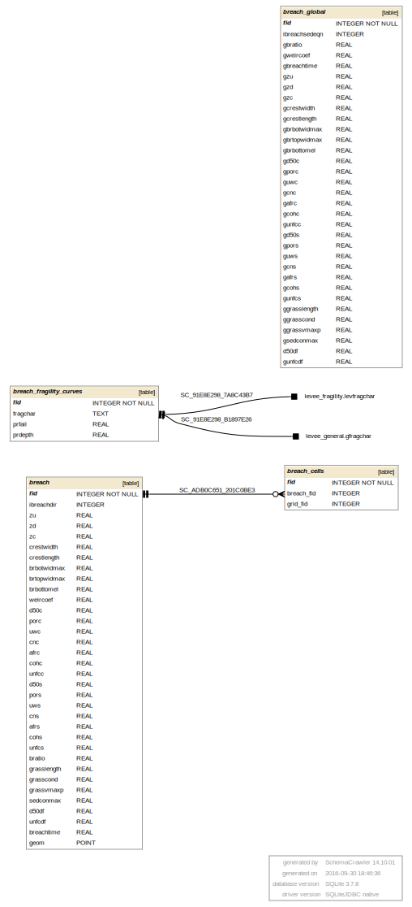

## BREACH.DAT 

BREACH.DAT information goes into the following GeoPackage tables:

* breach_global - global breach parameters table
* breach - point layer with location and individual breach parameters
* breach_cells - grid elements with individual breach parameters
* breach_fragility_curves - fragility curves data for a levee or a dam

[BREACH tables graph in PDF](db_schema_graphs/breach.pdf)

**gpkg table: breach_global** 

* "fid" INTEGER NOT NULL PRIMARY KEY,
* "ibreachsedeqn" INTEGER, -- IBREACHSEDEQN, sediment transport equation number
* "gbratio" REAL, -- GBRATIO, global ratio of the initial breach width to breach depth
* "gweircoef" REAL, -- GWEIRCOEF, global weir coefficient for piping or breach channel weir for an unspecified failure location
* "gbreachtime" REAL -- GBREACHTIME, cumulative duration (hrs) that the levee erosion will initiate after the water surface exceeds the specified pipe elevation BRBOTTOMEL
* "gzu" REAL, -- GZU, global slope of the upstream face of the levee or dam for an unspecified
failure location
* "gzd" REAL, -- GZD, global slope of the downstream face of the levee or dam
* "gzc" REAL, -- GZC, global average slope of the upstream and downstream face of the levee or
dam core material
* "gcrestwidth" REAL, -- GCRESTWIDTH, global crest length of the levee or dam
* "gcrestlength" REAL, -- GCRESTLENGTH, global crest length of the levee or dam
* "gbrbotwidmax" REAL, -- GBRBOTWIDMAX, maximum allowable global breach bottom width (ft or m) as constrained by the valley cross section
* "gbrtopwidmax" REAL, -- GBRTOPWIDMAX, maximum allowable global breach top width (ft or m) as constrained by the valley cross section
* "gbrbottomel" REAL, -- GBRBOTTOMEL, initial global breach or pipe bottom elevation (ft or m)
* "gd50c" REAL, -- GD50C, mean sediment size (D50 in mm) of the levee or dam core material
* "gporc" REAL, -- GPORC, global porosity of the levee or dam core material
* "guwc" REAL, -- GUWC, global unit weight (lb/ft 3 or N/m 3 ) of the levee or dam core material
* "gcnc" REAL, -- GCNC, global Manning’s n-value of the levee or dam core material
* "gafrc" REAL, -- GAFRC, global angle (degrees) of internal friction of the core material for the entire
levee or dam, 0 for no core
* "gcohc" REAL, -- GCOHC, global cohesive strength (lb/ft 2 or N/m 2 ) of the levee or dam core material
* "gunfcc" REAL, -- GUNFCC, global sediment gradient, ratio of D90 to D30 of the levee or dam core material
* "gd50s" REAL, -- GD50S, mean sediment size (D50 in mm) of the levee or dam shell material
* "gpors" REAL, -- GPORS, global porosity of the levee or dam shell material
* "guws" REAL, -- GUWS, global unit weight (lb/ft 3 or N/m 3 ) of the levee or dam shell material
* "gcns" REAL, -- GCNS, global Manning’s n-value of the levee or dam shell material
* "gafrs" REAL, -- GAFRS, global angle (degrees) of internal friction of the shell material for the entire
levee or dam, 0 for no core
* "gcohs" REAL, -- GCOHS, global cohesive strength (lb/ft 2 or N/m 2 ) of the levee or dam shell material
* "gunfcs" REAL, -- GUNFCS, global sediment gradient, ratio of D90 to D30 of the levee or dam shell material
* "ggrasslength" REAL, -- GGRASSLENGTH, global average length of grass (inches or mm) on downstream face
* "ggrasscond" REAL, -- GGRASSCOND, condition of the grass on the downstream face
* "ggrassvmaxp" REAL, -- GGRASSVMAXP, global maximum permissible velocity (fps or mps) for a grass-lined downstream face before the grass is eroded
* "gsedconmax" REAL, -- GSEDCONMAX, global maximum sediment concentration by volume in the breach discharge
* "d50df" REAL, -- D50DF, mean sediment size (D50 in mm) of the top one foot (0.3 m) of the downstream face (riprap material)
* "gunfcdf" REAL -- GUNFCDF, global sediment gradient, ratio of D 90 to D 30 of the downstream face upper one foot of material (riprap)

**gpkg table: breach** 

* "fid" INTEGER NOT NULL PRIMARY KEY,
* "ibreachdir" INTEGER, -- IBREACHDIR, direction of breach
* "zu" REAL, -- ZU, slope of the upstream face of the levee or dam
* "zd" REAL, -- ZD, slope of the downstream face of the levee or dam
* "zc" REAL -- ZC, average slope of the upstream and downstream face of the levee or dam
core material
* "crestwidth" REAL, -- CRESTWIDTH, crest width of the levee or dam
* "crestlength" REAL, -- CRESTLENGTH, length of the crest of the levee or dam
* "brbotwidmax" REAL, -- BRBOTWIDMAX, maximum allowable breach bottom width (ft or m) as constrained by the valley cross section
* "brtopwidmax" REAL, -- BRTOPWIDMAX, maximum allowable breach top width (ft or m) as constrained by the valley cross section
* "brbottomel" REAL, -- BRBOTTOMEL, initial breach or pipe bottom elevation (ft or m)
* "weircoef" REAL, -- WEIRCOEF, weir coefficient for piping or breach channel weir
* "d50c" REAL, -- D50C, mean sediment size (D50 in mm) of the levee or dam core material
* "porc" REAL, -- PORC, porosity of the levee or dam core material
* "uwc" REAL, -- UWC, unit weight (lb/ft 3 or N/m 3 ) of the levee or dam core material
* "cnc" REAL, -- CNC, global Manning’s n-value of the levee or dam core material
* "afrc" REAL, -- AFRC, angle (degrees) of internal friction of the core material for the entire
levee or dam, 0 for no core
* "cohc" REAL, -- COHC, cohesive strength (lb/ft 2 or N/m 2 ) of the levee or dam core material
* unfcc" REAL, -- UNFCC, sediment gradient, ratio of D90 to D30 of the levee or dam core material
* "d50s" REAL, -- D50S, mean sediment size (D50 in mm) of the levee or dam shell material
* "pors" REAL, -- PORS, porosity of the levee or dam shell material
* "uws" REAL, -- UWS, unit weight (lb/ft 3 or N/m 3 ) of the levee or dam shell material
* "cns" REAL, -- CNS, Manning’s n-value of the levee or dam shell material
* "afrs" REAL, -- AFRS, angle (degrees) of internal friction of the shell material for the entire
levee or dam, 0 for no core
* "cohs" REAL, -- COHS, cohesive strength (lb/ft 2 or N/m 2 ) of the levee or dam shell material
* "unfcs" REAL, -- UNFCS, sediment gradient, ratio of D90 to D30 of the levee or dam shell material
* "bratio" REAL, -- BRATIO, ratio of the initial breach width to breach depth
* "grasslength" REAL, -- GRASSLENGTH, average length of grass (inches or mm) on downstream face
* "grasscond" REAL, -- GRASSCOND, condition of the grass on the downstream face
* "grassvmaxp" REAL, -- GRASSVMAXP, maximum permissible velocity (fps or mps) for a grass-lined downstream face before the grass is eroded
* "sedconmax" REAL, -- maximum sediment concentration by volume in the breach discharge
* "d50df" REAL, -- D50DF, mean sediment size (D50 in mm) of the top one foot (0.3 m) of the downstream face (riprap material)
* "unfcdf" REAL, -- UNFCDF, sediment gradient, ratio of D 90 to D 30 of the downstream face upper one foot of material (riprap)
* "breachtime" REAL -- BREACHTIME, cumulative duration (hrs) that the levee erosion will initiate after the water surface exceeds the specified pipe elevation BRBOTTOMEL
* "geom" POINT, location of a breach, on import: create geometry as points = grid elements' centroids with grid fid = IBREACHGRID)

**gpkg table: breach_cells** (grid elements with individual breach parameters)

* "fid" INTEGER NOT NULL PRIMARY KEY,
* "breach_fid" INTEGER, -- fid of a breach from breach table
* "grid_fid" INTEGER -- IBREACHGRID, grid element fid for which an individual breach parameters are defined

**gpkg table: breach_fragility_curves** (breach fragility curves)

* "fid" INTEGER NOT NULL PRIMARY KEY,
* "fragchar" TEXT, -- FRAGCHAR, fragility curve ID - one letter and a number
* "prfail" REAL, -- PRFAIL, levee fragility curve point of failure probability
* "prdepth" REAL -- PRDEPTH, point of failure on the levee as defined by the distance or height below the levee crest

