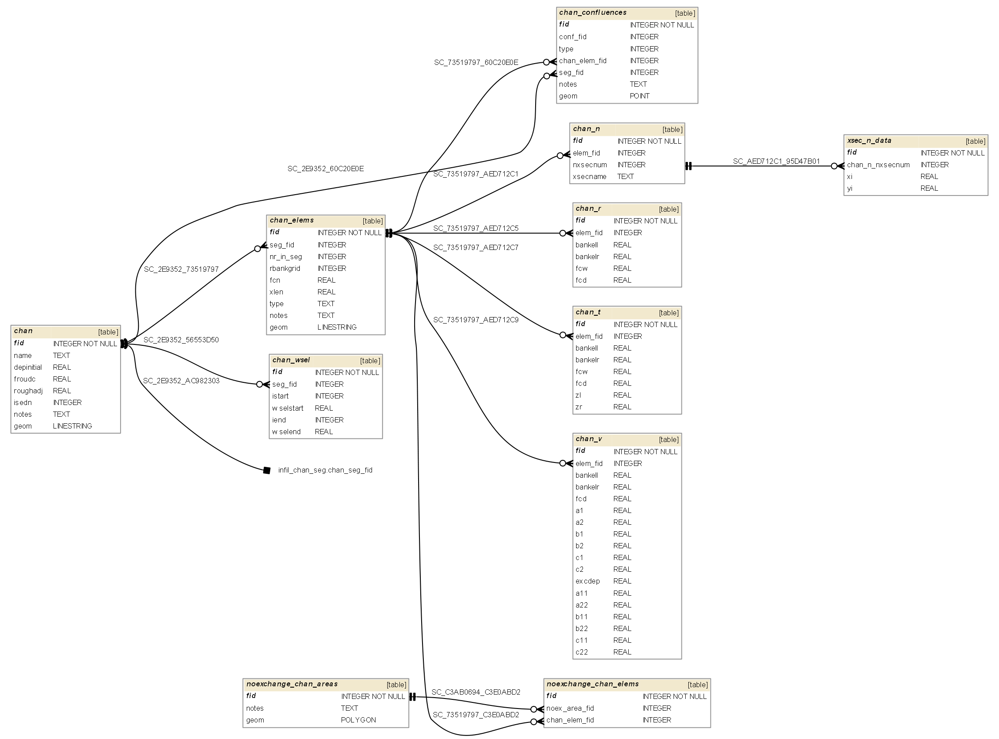

## CHAN.DAT 

CHAN.DAT information goes into the following GeoPackage tables:

* chan - channel segments table
* chan_elems - channel elements (part of segment contained in a grid element)
* chan_r - Rectangular cross-sections
* chan_t - Trapezoidal cross-sections
* chan_v - Variable area cross-sections
* chan_n - Natural cross-sections
* chan_confluences - pairs of grid elements where channel segments meet
* noexchange_chan_areas - areas where channel elements do not exchange flow with floodplain
* noexchange_chan_elems - channel elements that do not exchange flow with floodplain
* chan_wsel - first and last channel elements that have water surface elevation specified

**gpkg table: chan** (channel segments table)

* "fid" INTEGER NOT NULL PRIMARY KEY,
* "name" TEXT, -- name of segment (optional)
* "depinitial" REAL, -- DEPINITIAL, initial channel flow depth
* "froudc" REAL, -- FROUDC, max Froude channel number
* "roughadj" REAL, -- ROUGHADJ, coefficient for depth adjustment
* "isedn" INTEGER, -- ISEDN, sediment transport equation or data
* "geom" POLYLINE -- geometry of channel segment

**gpkg table: chan_elems** (channel elements table)

* "fid" INTEGER NOT NULL PRIMARY KEY, -- ICHANGRID, grid element number for left bank
* "seg_fid" INTEGER, -- fid of cross-section's segment
* "nr_in_seg" INTEGER, -- cross-section number in segment
* "rbankgrid" INTEGER, -- RIGHTBANK, right bank grid element fid
* "fcn" REAL, -- FCN, average Manning's n in the grid element
* "xlen" REAL, -- channel length contained within the grid element ICHANGRID
* "type" TEXT, -- SHAPE, type of cross-section shape definition
* "notes" TEXT
* "geom" POLYLINE -- geometry of channel segment

**gpkg table: chan_r** (rectangular cross-sections)

* "fid" INTEGER NOT NULL PRIMARY KEY,
* "elem_fid" INTEGER, -- fid of cross-section's element
* "bankell" REAL, -- BANKELL, left bank elevation
* "bankelr" REAL, -- BANKELR, right bank elevation
* "fcw" REAL, -- FCW, channel width
* "fcd" REAL, -- channel channel thalweg depth (deepest part measured from the lowest bank)

**gpkg table: chan_v** (variable area cross-sections)

* "fid" INTEGER NOT NULL PRIMARY KEY,
* "elem_fid" INTEGER, -- fid of cross-section's element
* "bankell" REAL, -- BANKELL, left bank elevation
* "bankelr" REAL, -- BANKELR, right bank elevation
* "fcd" REAL, -- channel channel thalweg depth (deepest part measured from the lowest bank)
* "a1" REAL, -- A1,
* "a2" REAL, -- A2,
* "b1" REAL, -- B1,
* "b2" REAL, -- B2,
* "c1" REAL, -- C1,
* "c2" REAL, -- C2,
* "excdep" REAL, -- EXCDEP, channel depth above which second variable area relationship will be applied
* "a11" REAL, -- A11,
* "a22" REAL, -- A22,
* "b11" REAL, -- B11,
* "b22" REAL, -- B22,
* "c11" REAL, -- C11,
* "c22" REAL -- C22,

**gpkg table: chan_t** (trapezoidal cross-sections)

* "fid" INTEGER NOT NULL PRIMARY KEY,
* "elem_fid" INTEGER, -- fid of cross-section's element
* "bankell" REAL, -- BANKELL, left bank elevation
* "bankelr" REAL, -- BANKELR, right bank elevation
* "fcw" REAL, -- FCW, channel width
* "fcd" REAL, -- channel channel thalweg depth (deepest part measured from the lowest bank)
* "zl" REAL, -- ZL left side slope
* "zr" REAL --ZR right side slope

**gpkg table: chan_n** (natural cross-sections)

* "fid" INTEGER NOT NULL PRIMARY KEY,
* "elem_fid" INTEGER, -- fid of cross-section's element
* "nxsecnum" INTEGER, -- NXSECNUM, surveyed cross section number assigned in XSEC.DAT
* "xsecname" TEXT -- xsection name

**gpkg table: chan_confluences** (channel confluences)

* "fid" INTEGER NOT NULL PRIMARY KEY,
* "type" INTEGER, -- tributary (0) / main channel (1) switch
* "chan_elem_fid" INTEGER, -- ICONFLO1 or ICONFLO2, tributary or main channel element fid
* "geom" POINT -- tributary or main channel confluence points. Centroid of grid element that the confluence belongs to.

**gpkg table: noexchange_chan_areas** (areas in which channel elements do not exchange flow with floodplain)

* "fid" INTEGER NOT NULL PRIMARY KEY,
* "geom" POLYGON, -- part of grid elem nr = NOEXCHANGE. When importing from ASCII, this could be a circle around grid element centroid

**gpkg table: noexchange_chan_elems** (channel elements that do not exchange flow with floodplain. This table is automatically filled by a geoprocessing trigger created for noexchange_chan_areas layer)

* "fid" INTEGER NOT NULL PRIMARY KEY,
* "chan_elem_fid" INTEGER, -- NOEXCHANGE, channel element number not exchanging flow. Filled in by a geoprocessing trigger

**gpkg table: chan_wsel** (channel elements with WSEL specified)

* "fid" INTEGER NOT NULL PRIMARY KEY,
* "seg_fid" INTEGER, -- found by geoprocessing trigger, channel segment for which the WSELs are specified
* "istart" INTEGER, -- ISTART, first channel element with a starting WSEL specified
* "wselstart" REAL, -- WSELSTART, first channel element starting WSEL
* "iend" INTEGER, -- IEND, last channel element with a starting WSEL specified
* "wselend" REAL -- WSELEND, last channel element starting WSEL

## CHANBANK.DAT 

CHANBANK.DAT information goes into the following GeoPackage tables:

* chan_elems - channel elements

Set 

* "rbankgrid" INTEGER, -- RIGHTBANK

where LEFTBANK = fid of chan_elems

## XSEC.DAT 

XSEC.DAT information goes into the following GeoPackage tables:

* chan_n - natural xsections table
* xsec_n_data - natural cross-sections data

See [tables graph here](#chandat).

**gpkg table: chan_n** (natural cross-sections)

* "xsecname" TEXT, -- XSECNAME - name of the cross-section

**gpkg table: xsec_n_data** (natural cross-sections data)

* "fid" INTEGER NOT NULL PRIMARY KEY,
* "nxsecnum" INTEGER, -- NXSECNUM, fid of cross-section in chan_n
* "x" REAL, -- XI, station distance from left point
* "y" REAL -- YI, elevation