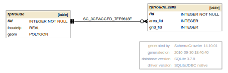

## FPFROUDE.DAT 

FPFROUDE.DAT information goes into the following GeoPackage tables:

* fpfroude - polygon layer with individual Froude numbers for grid cells
* fpfroude_cells - grid elements with individual Froude number

[FPFROUDE tables graph](db_schema_graphs/fpfroude.pdf)

**gpkg table: fpfroude** (polygon layer with individual Froude #)

* "fid" INTEGER NOT NULL PRIMARY KEY,
* "froudefp" REAL -- FROUDEFP, Froude number for grid elements
* "geom" POLYGON, -- polygons with a Froude number for grid elements, on import: create the geometry as shrunk grid cells polygons listed in FPFROUDE.DAT

**gpkg table: fpfroude_cells** (grid elements with individual Froude #)

* "fid" INTEGER NOT NULL PRIMARY KEY,
* "area_fid" INTEGER, -- fid of area from frfroude table
* "grid_fid" INTEGER, -- grid element fid that has an individual Froude number

