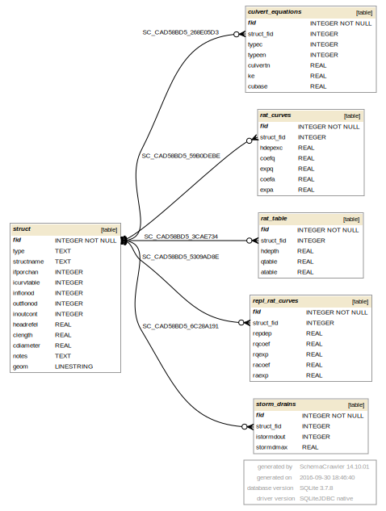

## HYSTRUC.DAT 

HYSTRUC.DAT information goes into the following GeoPackage tables:

* struct - general info about each structure, STRUCHAR=S
* rat_curves - rating curves data, STRUCHAR=C
* repl_rat_curves - replacement rating curves data, STRUCHAR=R
* rat_table - rating tables data, STRUCHAR=T
* culvert_equations - culvert equations data, STRUCHAR=F
* storm_drains - storm drains data, STRUCHAR=D

[HYSTRUC tables graph in PDF](db_schema_graphs/struct.pdf)

**gpkg table: struct** (general info about each structure, STRUCHAR=S)

* "fid" INTEGER NOT NULL PRIMARY KEY,
* "type" TEXT, -- type of the structure, equal to the next line's STRUCHAR, decides in which table the data are stored (C for rating_curves table, R for repl_rat_curves, T for rat_table, F for culvert_equations, or D for storm_drains)
* "structname" TEXT, -- STRUCTNAME, name of the structure
* "ifporchan" INTEGER, -- IFPORCHAN, switch, 0 for floodplain structure (shares discharge between 2 floodplain elements), 1 for channel structure (channel to channel), 2 for floodplain to channel, 3 for channel to floodplain
* "icurvtable" INTEGER, -- ICURVTABLE, switch, 0 for rating curve, 1 for rating table, 2 for culvert equation
* "inflonod" INTEGER, -- INFLONOD, grid element containing the structure or structure inlet
* "outflonod" INTEGER, -- OUTFLONOD, grid element receiving the structure discharge (structure outlet) 
* "inoutcont" INTEGER, -- INOUTCONT, 0 for no tailwater effects - compute discharge based on headwater, 1 for reduced discharge (no upstream flow allowed), 2 for reduced discharge and upstream flow allowed
* "headrefel" REAL, -- HEADREFEL, reference elevation above which the headwater is determined, Set 0.0 to use existing channel bed
* "clength" REAL, -- CLENGTH, culvert length,
* "cdiameter" REAL, -- CDIAMETER, culvert diameter,
* "notes" TEXT -- structure notes
* geom (LINESTRING) - structure geometrical representation - line from inflow to outflow

**gpkg table: rat_curves** (rating curves data, STRUCHAR=C)

* "fid" INTEGER NOT NULL PRIMARY KEY,
* "struct_fid" INTEGER, -- structure fid, for which the data are defined
* "hdepexc" REAL, -- HDEPEXC, maximum depth that a hydraulic structure rating curve is valid
* "coefq" REAL, -- COEFQ, discharge rating curve coefficients as a power function of the headwater depth. If 0 discharge is calculated as normal depth flow routing
* "expq" REAL, -- EXPQ, hydraulic structure discharge exponent where the discharge is expressed as a power function of the headwater depth
* "coefa" REAL, -- COEFA, flow area rating curve coefficient where the flow area A is expressed as a power function of the headwater depth, A = COEFA * depth**EXPA
* "expa" REAL -- EXPA, hydraulic structure flow area exponent where the flow area is expressed
as a power function of the headwater depth

**gpkg table: repl_rat_curves** (replacement rating curves data, STRUCHAR=R)

* "fid" INTEGER NOT NULL PRIMARY KEY,
* "struct_fid" INTEGER, -- structure fid, for which the data are defined
* "repdep" REAL, -- REPDEP, flow depth that if exceeded will invoke the replacement structure
rating curve parameters
* "rqcoef" REAL, -- RQCOEFQ (or RQCOEF), structure rating curve discharge replacement coefficients
* "rqexp" REAL, -- RQEXP, structure rating curve discharge replacement exponent
* "racoef" REAL, -- RACOEF, structure rating curve flow area replacement coefficient
* "raexp" REAL -- RAEXP, structure rating curve flow area replacement exponent

**gpkg table: rat_table** (rating tables data, STRUCHAR=T)

* "fid" INTEGER NOT NULL PRIMARY KEY,
* "struct_fid" INTEGER, -- structure fid, for which the data are defined
* "hdepth" REAL, -- HDEPTH, headwater depth for the structure headwater depth-discharge rating table
* "qtable" REAL, -- QTABLE, hydraulic structure discharges for the headwater depths
* "atable" REAL -- ATABLE, hydraulic structure flow area for each headwater depth in the rating table

**gpkg table: culvert_equations** (culvert equations data, STRUCHAR=F)

* "fid" INTEGER NOT NULL PRIMARY KEY,
* "struct_fid" INTEGER, -- structure fid, for which the data are defined
* "typec" INTEGER, -- TYPEC, culvert switch, 1 for a box culvert and 2 for a pipe culvert 
* "typeen" INTEGER, -- TYPEEN, culvert switch for entrance type 1, 2, or 3
* "culvertn" REAL, -- CULVERTN, culvert Manning’s roughness coefficient
* "ke" REAL, -- KE, culvert entrance loss coefficient
* "cubase" REAL -- CUBASE, flow width of box culvert for TYPEC = 1. For a circular culvert, CUBASE = 0

**gpkg table: storm_drains** (storm drains data, STRUCHAR=D)

* "fid" INTEGER NOT NULL PRIMARY KEY,
* "struct_fid" INTEGER, -- structure fid, for which the data are defined
* "istormdout" INTEGER, -- ISTORMDOUT, hydraulic structure outflow grid element number used to simulate a simplified storm drain (junction or outflow node)
* "stormdmax" REAL -- STORMDMAX, maximum allowable discharge (conveyance capacity) of the collection pipe represented by the ISTORMDOUT element.

