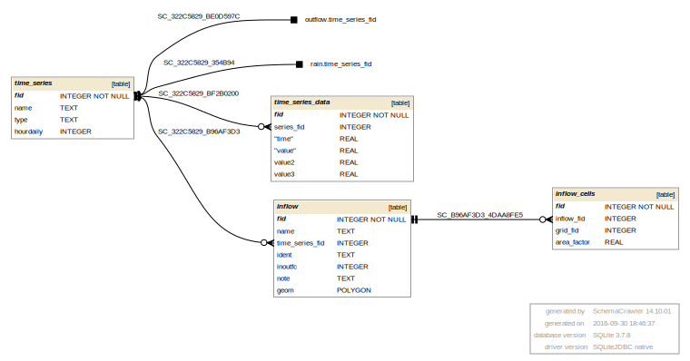

## INFLOW.DAT 

INFLOW.DAT information goes into the following GeoPackage tables: 

* inflow
* inflow_cells
* time_series
* time_series_data
* reservoirs
* cont

[INFLOW tables graph in PDF](db_schema_graphs/inflow.pdf)

**gpkg table: inflow** (contains general info about each inflow)

* "fid" INTEGER NOT NULL PRIMARY KEY,
* "name" TEXT, -- name of inflow
* "time_series_fid" INTEGER REFERENCES time_series(fid), -- id of time series used for inflow
* "indent" TEXT NOT NULL, -- destination element type **C**hannel, **F**loodplain (**R**eservoir data goes into separate table resorvoirs)
* "inoutfc" INTEGER NOT NULL, -- INOUTFC = 0 for inflow and 1 for outflow
* "geom" POLYGON, -- area of inflow/reservoir. In case of translating from DAT: it could be a part of the grid cell interior where the inflow is located in (grid_fid = KHIN). The geometry modification triggers geoprocessing analysis: find grid cells affected -> table inflow_cells.
* "note" TEXT

**gpkg table: inflow_cells** (cells being affected by an inflow)

* "fid" INTEGER NOT NULL PRIMARY KEY, 
* "inflow_fid" INTEGER NOT NULL REFERENCES inflow(fid), -- inflow id
* "grid_fid" INTEGER NOT NULL REFERENCES grid(fid), -- KHIN - grid element id affected by an inflow
* "area_factor" REAL, -- percentage area of an inflow located in that grid cell - used for assigning relevant percentage of inflow value to a particular cell

**gpkg table: time_series** (named time series)

* "fid" INTEGER NOT NULL PRIMARY KEY,
* "name" TEXT, -- name of time series
* "type" TEXT, -- type of data
* "hourdaily" INTEGER NOT NULL, -- IHOURDAILY - is time given in hours (0) or days (1)

**gpkg table: time_series_data** (time series data)

* "fid" INTEGER NOT NULL PRIMARY KEY,
* "series_fid" INTEGER NOT NULL REFERENCES time_series(fid), -- fid of time series the data pair belongs to
* "time" REAL NOT NULL, -- time
* "value" REAL NOT NULL -- value1
* "value2" REAL NOT NULL -- value2
* "value3" REAL NOT NULL -- value3

**gpkg table: reservoirs** (reservoirs location and levels)

* "fid" INTEGER NOT NULL PRIMARY KEY,
* "name" TEXT, -- name of reservoir
* "grid_fid" INTEGER, -- id of grid element where the reservoir centroid is located (automatically filled when the geom is created/modified)
* "wsel" REAL, -- reservoir water surface elevation
* "geom" POLYGON, -- area of reservoir. In case of translating from DAT: it could be a part of the grid cell interior where the inflow is located in (grid_fid = KHIN). The geometry creation or modification triggers geoprocessing analysis: find a grid cell where the centroid is located (reservoir must be assign to a single grid element)
* "note" TEXT

**gpkg table: cont** See [CONT.DAT](#cont).

* parameter name: "inflow_plt_fid",  value: IDEPLT (id of grid element whose hydrograph should be shown at runtime)

## INFLOWx_DS.DAT 

Undocumented...

