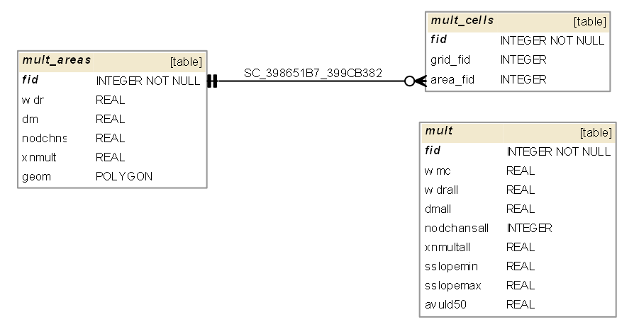

## MULT.DAT 

MULT.DAT information goes into the following GeoPackage tables:

* mult - global multiple channels parameters for all the grid elements, line 1
* mult_areas - polygon layer with individual multiple channels parameters, line 2
* mult_cells - grid cells with individual multiple channel parameters, line 2

**gpkg table: mult** (global multiple channels parameters for all the grid elements, line 1) 

* "fid" INTEGER NOT NULL PRIMARY KEY,
* "wmc" REAL, -- WMC, incremental width by which multiple channels will be expanded when the
maximum depth DM is exceeded
* "wdrall" REAL, -- WDRALL, global assignment of the multiple channel width
* "dmall" REAL, -- DMALL, global assignment of the maximum depth
* "nodchansall" INTEGER, -- NODCHNSALL, global assignment of the number of multiple channels
* "xnmultall" REAL, -- XNMULTALL, global assignment of the multiple channel n-values
* "sslopemin" REAL, -- SSLOPEMIN, minimum slope that multiple channel assignments will be made
* "sslopemax" REAL, -- SSLOPEMAX, maximum slope that multiple channel assignments will be made

**gpkg table: mult_areas** (polygon layer with individual multiple channels parameters, line 2)

* "fid" INTEGER NOT NULL PRIMARY KEY,
* "wdr" REAL, -- WDR, channel width for individual grid elements
* "dm" REAL, -- DM, maximum depth of multiple channels
* "nodchns" REAL, -- NODCHNS, number of multiple channels assigned in a grid element
* "xnmult" REAL -- XNMULT, channel n-values for individual grid elements
* "geom" POLYGON -- on import: create geometry as a part of each grid cell listed in MULT.DAT (IGRID)

**gpkg table: mult_cells** (grid cells with individual multiple channel parameters, line 2) - this table is filled automatically by geoprocessing trigger based on polygons and values from mult_areas table

* "fid" INTEGER NOT NULL PRIMARY KEY,
* "grid_fid" INTEGER, -- equal to fid from grid table
* "area_fid" INTEGER -- fid of area from mult_areas

