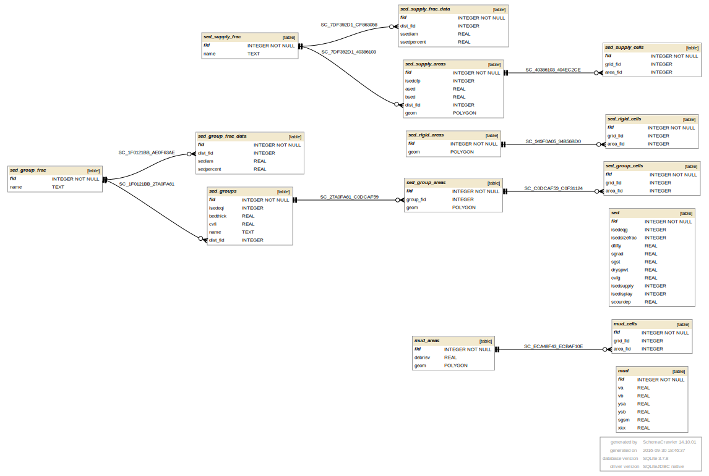

## SED.DAT 

SED.DAT information goes into the following GeoPackage tables:

* mud - global mudflow parameters
* mud_areas - polygon layer with areas where a mudflow (debris volume) is defined
* mud_cells - grid elements with debris volume defined
* sed - global sediment transport parameters
* sed_groups - sediment transport parameters groups
* sed_group_areas - polygon layer with areas where a sediment group is defined
* sed_group_cells - grid elements with a sediment group defined
* sed_group_frac_data - sediment size fractions for sediment groups
* sed_rigid_areas - polygon layer with rigid bed defined
* sed_rigid_cells - grid elements with rigid bed
* sed_supply_areas - polygon layer with a sediment supply defined
* sed_supply_cells - grid elements with a sediment supply rating curve defined
* sed_supply_frac - named sediment supply rating curve size fraction distributions
* sed_supply_frac_data - sediment supply rating curve size fraction distribution data

[SED tables graph in PDF](db_schema_graphs/sed.pdf)

**gpkg table: mud** (global mudflow parameters) - line M

* "fid" INTEGER NOT NULL PRIMARY KEY,
* "va" REAL, -- VA, coefficient in the viscosity versus sediment concentration by volume relationship
* "vb" REAL, -- VB, exponent in the viscosity versus sediment concentration by volume relationship
* "ysa" REAL, -- YSA, coefficient of the yield stress versus sediment concentration
* "ysb" REAL, -- YSB, exponent of yield stress versus sediment concentration
* "sgsm" REAL, -- SGSM, mudflow mixtures specific gravity
* "xkx" REAL -- XKX, the laminar flow resistance parameter for overland flow

**gpkg table: mud_areas** (polygon layer with areas where a mudflow (debris volume) is defined) - line D

* "fid" INTEGER NOT NULL PRIMARY KEY,
* "debrisv" REAL -- DEBRISV, volume of the debris basin
* "geom" POLYGON -- polygons with a mudflow defined, on import: create polygons as shrunk grid elements with fid listed as JDEBNOD

**gpkg table: mud_cells** (grid elements with debris basin) - line D

* "fid" INTEGER NOT NULL PRIMARY KEY,
* "grid_fid" REAL, -- JDEBNOD, grid element fid with debris basin
* "area_fid" INTEGER -- fid of area from mud_areas table, where the cell belongs to

**gpkg table: sed** (global sediment transport parameters) - line C

* "fid" INTEGER NOT NULL PRIMARY KEY,
* "isedeqg" INTEGER, -- ISEDEQG, transport equation number used in sediment routing for overland flow
* "isedsizefrac" INTEGER, -- ISEDSIZEFRAC, switch, if 1 sediment routing will be performed by size
fraction, 0 for sed routing not by size fraction
* "dfifty" REAL, -- DFIFTY, sediment size (D50) in mm for sediment routing
* "sgrad" REAL, -- SGRAD, sediment gradation coefficient (non-dimensional)
* "sgst" REAL, -- SGST, sediment specific gravity
* "dryspwt" REAL, -- DRYSPWT, dry specific weight of the sediment
* "cvfg" REAL, -- CVFG, fine sediment volumetric concentration for overland, channel, and streets
* "isedsupply" INTEGER, -- ISEDSUPPLY, if 1 sediment rating curve will be used to define the sediment supply to a channel reach or floodplain area, otherwise 0
* "isedisplay" INTEGER, -- ISEDISPLAY, grid element number for which the sediment transport capacity for all the sediment transport equations will be listed by output
* "scourdep" REAL -- maximum allowable scour depth for all floodplain elements

**gpkg table: sed_group_areas** (polygon layer with areas where a sediment group is defined)

* "fid" INTEGER NOT NULL PRIMARY KEY,
* "group_fid" INTEGER -- sediment group fid for area (from sed_groups table)
* "geom" POLYGON -- polygons with a sediment group defined, on import: create polygons as shrunk grid elements with fid listed as ISEDGRID in sed_group_cells

**gpkg table: sed_groups** (sediment transport parameters groups) - line Z: there are as many groups as Z-lines

* "fid" INTEGER NOT NULL PRIMARY KEY,
* "isedeqi" INTEGER, -- ISEDEQI, sediment transport equation used for sediment routing by size fraction
* "bedthick" REAL, -- BEDTHICK, sediment bed thickness for sediment routing by size fraction
* "cvfi" REAL -- CVFI, fine sediment volumetric concentration for an individual channel segment(s)
* "name" TEXT, -- name of the sediment transport parameters group
* "dist_fid" INTEGER -- fraction distribution number (from sed_group_frac_data table) for that group

**gpkg table: sed_group_frac_data** (sediment size fractions for sediment groups) - line P

* "fid" INTEGER NOT NULL PRIMARY KEY,
* "dist_fid" INTEGER, -- fraction distribution number
* "sediam" REAL, -- SEDIAM, representative sediment diameter (mm) for sediment routing by size fraction
* "sedpercent" REAL -- SEDPERCENT, sediment size distribution percentage

**gpkg table: sed_group_cells** (grid elements with a sediment group defined) - line G

* "fid" INTEGER NOT NULL PRIMARY KEY,
* "grid_fid" INTEGER, -- ISEDUM, grid element fid for which a sediment group is defined
* "area_fid" INTEGER -- fid of area from sed_group_areas table, where the cell belongs to

**gpkg table: sed_rigid_areas** (polygon layer with rigid bed defined) - line R

* "fid" INTEGER NOT NULL PRIMARY KEY
* "geom" POLYGON -- polygons with a rigid bed  defined, on import: create polygons as shrunk grid elements with fid listed as ICRETIN in sed_rigid_cells

**gpkg table: sed_rigid_cells** (grid elements with rigid bed) - line R

* "fid" INTEGER NOT NULL PRIMARY KEY,
* "grid_fid" INTEGER, -- ICRETIN, grid element fid for which the rigid bed is defined
* "area_fid" INTEGER -- area fid with rigid bed defined (from sed_rigid_areas)

**gpkg table: sed_supply_areas** (polygon layer with a sediment supply defined) - line S

* "fid" INTEGER NOT NULL PRIMARY KEY,
* "isedcfp" INTEGER, -- ISEDCFP, switch, 0 for floodplain sediment supply rating curve, 1 for channel
* "ased" REAL, -- ASED, sediment rating curve coefficient
* "bsed" REAL -- BSED, sediment rating curve exponent, Qs = ASED * Qw ^ BSED
* "dist_fid" INTEGER, -- named sediment supply fraction distribution fid from sed_supply_frac table
* "geom" POLYGON -- polygons with a sediment supply defined, on import: create polygons as shrunk grid elements with fid listed as ISEDGRID in sed_supply_cells

**gpkg table: sed_supply_cells** (grid elements with a sediment supply rating curve defined) - line S

* "fid" INTEGER NOT NULL PRIMARY KEY,
* "grid_fid" INTEGER, -- ISEDGRID, grid element fid for which sediment supply is defined
* "area_fid" INTEGER -- area fid with a sediment supply defined (from sed_supply_areas)

**gpkg table: sed_supply_frac** (named sediment supply rating curve size fraction distributions) - line N

* "fid" INTEGER NOT NULL PRIMARY KEY,
* "name" TEXT

**gpkg table: sed_supply_frac_data** (sediment supply rating curve size fraction distribution data) - line N

* "fid" INTEGER NOT NULL PRIMARY KEY,
* "dist_fid" INTEGER -- nr of distribution the fraction belongs to, from sed_supply_frac table
* "ssediam" REAL, -- SSEDIAM, representative sediment supply diameter (mm) for sediment routing by size fraction
* "ssedpercent" REAL -- SSEDPERCENT, sediment supply size distribution percentage

