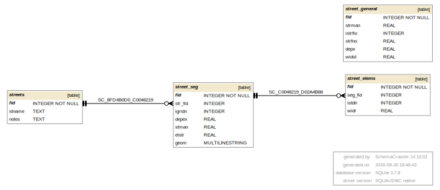

## STREET.DAT 

STREET.DAT information goes into the following GeoPackage tables:

* street_general - general streets parameters, first line of STREET.DAT
* streets - streets table, contains fid and name, STRCHAR=N
* street_seg - street segments table, street specific data and its geometry, STRCHAR=S
* street_elems - street elements data table, STRCHAR=W

[STREET tables graph in PDF](db_schema_graphs/street.pdf)

**gpkg table: street_general** (general streets parameters)

* "fid" INTEGER NOT NULL PRIMARY KEY,
* "strman" REAL, -- STRMAN, global n-value for street flow
* "istrflo" INTEGER, -- ISTRFLO, if equal to 1 specifies that the floodplain inflow hydrograph will enter the streets rather than entering the overland portion of the grid element
* "strfno" REAL, -- STRFNO, maximum street Froude number
* "depx" REAL, -- DEPX, street curb height
* "widst" REAL, -- WIDST, global assignment of street width to all streets

**gpkg table: streets** (streets table, STRCHAR=N)

* "fid" INTEGER NOT NULL PRIMARY KEY,
* "stname" TEXT, -- STNAME, character name of the street. Up to 15 characters can be used
* "notes" TEXT, -- notes for a street

**gpkg table: street_seg** (streets segments table, STRCHAR=S)

* "fid" INTEGER NOT NULL PRIMARY KEY,
* "str_fid" INTEGER, -- street fid for the street segment (from streets table)
* "igridn" INTEGER, -- IGRIDN, grid element number
* "depex" REAL, -- DEPX(L) or DEPEX(L), optional curb height, 0 to use global DEPX
* "stman" REAL, -- STMAN(L), optional spatially variable street n-value within a given grid element. 0 for global
* "elstr" REAL, -- ELSTR(L), optional street elevation. If 0, the model will assign the street elevation as grid element elevation
* "geom" MULTILINESTRING, on import: create geometry based on line 4 - lines from center of grid cells in 8 possible directions

**gpkg table: street_elems** (street elements data table, STRCHAR=W)

* "fid" INTEGER NOT NULL PRIMARY KEY,
* "seg_fid" INTEGER, -- street segment fid for the street element (from street_seg table)
* "istdir" INTEGER, -- ISTDIR, street element direction (flow direction) from the center of the grid element to a neighbouring element, 1-8
* "widr" REAL, -- WIDR, optional grid element street width in the ISTDIR direction

