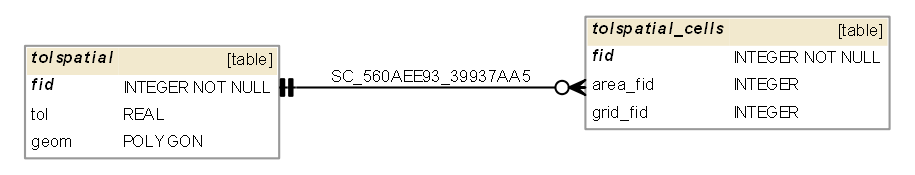

## TOLER.DAT 

Simulation tolerances. Information gets added to table [cont](#cont). 

## TOLSPATIAL.DAT 

TOLSPATIAL.DAT information goes into the following GeoPackage tables:

* tolspatial - polygon layer with a tolerance value for grid cells
* tolspatial_cells - grid cells with an individual tolerance value

**gpkg table: tolspatial** 

* "fid" INTEGER NOT NULL PRIMARY KEY,
* "tol" REAL -- TOL, tollerance for grid cells contained in the polygon. A grid cell is considered contained in a polygon if its centroid is contained in it.
* "geom" POLYGON -- on import: create the geometry as shrunk grid cell with fid = IDUM

**gpkg table: tolspatial_cells** 

* "fid" INTEGER NOT NULL PRIMARY KEY,
* "area_fid" REAL, -- fid of a polygon from tolspatial table
* "grid_fid" INTEGER -- IDUM, fid of grid cell contained in a fpxsection

