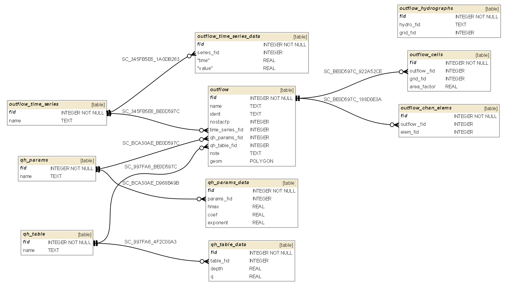

OUTFLOW.DAT
===========

OUTFLOW.DAT information goes into the following GeoPackage tables:

* outflow
* outflow_cells
* outflow_time_series
* outflow_time_series_data
* qh_params
* qh_params_data
* qh_table
* qh_table_data
* out_hydrographs
* out_hydrographs_cells

:download:`OUTFLOW.DAT tables schema `

**gpkg table: outflow** (contains general info about each outflow)

* "fid" INTEGER PRIMARY KEY NOT NULL,
* "name" TEXT,-- name of outflow
* "chan_out" INTEGER, -- = 1  if there is a K line for that outflow, NULL otherwise
* "fp_out" INTEGER, -- = 1 if there is a O line for that outflow, NULL otherwise
* "chan_tser_fid" INTEGER, -- time series fid for CHANNEL, if there is any (OUTCHAR N with NOSTACFP = 1)
* "chan_qhpar_fid" INTEGER, -- qh_params fid for CHANNEL, if there is any (OUTCHAR H after K)
* "chan_qhtab_fid" INTEGER, -- qh_table fid for CHANNEL, if there is any (OUTCHAR T after K)
* "fp_tser_fid" INTEGER, -- time series fid for FLOODPLAIN, if there is any (OUTCHAR N with NOSTACFP = 0)
* "note" TEXT
* "geom" POLYGON -- area of outflow. In case of translating from DAT: it could be a part of the grid cell interior where the outflow is located in or a part of channel (grid_fid = NOSTA when ident = K and elem_id = KOUT when ident = K). When users modify the geometry automatic geoprocessing triggers will find grid cells or channel elements affected -> table outflow_cells.

**gpkg table: outflow_cells** (cells being affected by an outflow)

* "fid" INTEGER NOT NULL PRIMARY KEY,
* "outflow_fid" INTEGER NOT NULL REFERENCES outflow(fid), -- outflow id
* "grid_fid" INTEGER NOT NULL REFERENCES grid(fid) -- NOSTA - grid element id affected by an outflow

**gpkg table: outflow_time_series** (named time series)

* "fid" INTEGER NOT NULL PRIMARY KEY,
* "name" TEXT, -- name of time series

**gpkg table: outflow_time_series_data** (time series data)

* "fid" INTEGER NOT NULL PRIMARY KEY,
* "series_fid" INTEGER NOT NULL REFERENCES time_series(fid), -- fid of time series the data pair belongs to
* "time" REAL NOT NULL, -- time
* "value" REAL NOT NULL -- value

**gpkg table: qh_params** (stage-discharge reletionship parameter groups)

* "fid" INTEGER NOT NULL PRIMARY KEY,
* "name" TEXT

**gpkg table: qh_params_data** (stage-discharge reletionship parameters data)

* "fid" INTEGER NOT NULL PRIMARY KEY,
* "params_fid" INTEGER, -- parameters group fid from qh_params table
* "hmax" REAL, -- HOUT(J,1)
* "coef" REAL, -- HOUT(J,2)
* "exponent" REAL, -- HOUT(J,3)

**gpkg table: qh_table** (stage-discharge tables)

* "fid" INTEGER PRIMARY KEY NOT NULL,
* "name" TEXT

**gpkg table: qh_table_data** (stage-discharge tables data)

* "fid" INTEGER PRIMARY KEY NOT NULL,
* "table_fid" INTEGER, -- fid of QH table
* "depth" REAL, -- CHDEPTH, depth above the thalweg
* "q" REAL -- CQTABLE, discharge for the channel outflow

**gpkg table: out_hydrographs** (named outflow hydrographs, O1-O9)

* "fid" INTEGER NOT NULL PRIMARY KEY,
* "hydro_fid" INTEGER NOT NULL, -- OUTCHAR, Ox (where x = 1-9) - number of outflow hydrograph to be created
* "name" TEXT -- optional name of outflow hydrograph
* "geom" POLYGON -- area of outflow. On import it could be a part of the grid cell interior where the outflow is located in or a part of channel. When users modify the geometry automatic geoprocessing triggers will find grid cells or channel elements affected -> table outflow_cells.

**gpkg table: out_hydrographs_cells** (grid cells for outflow hydrographs)

* "fid" INTEGER NOT NULL PRIMARY KEY,
* "hydro_fid" INTEGER REFERENCES out_hydrographs(fid),
* "grid_fid" INTEGER

