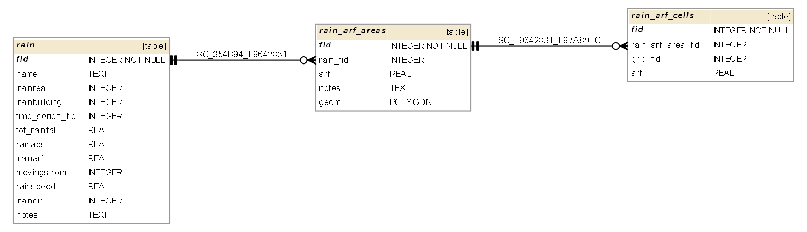

RAIN.DAT
========

RAIN.DAT information goes into the following GeoPackage tables:

* rain - general rain information table
* rain_arf_areas - layer (table with geometry) with areas and ARF values defined
* rain_arf_cells - table of grid cells located in a rain_arf_area
* time_series (rainfall intesity)
* time_series_data

:download:`RAIN.DAT tables schema `

**gpkg table: rain** (general info about rainfall)

* "fid" INTEGER NOT NULL PRIMARY KEY,
* "name" TEXT, -- name of rain
* "irainreal" INTEGER, -- IRAINREAL switch for real-time rainfall (NEXRAD)
* "ireainbuilding" INTEGER, -- IRAINBUILDING, switch, if 1 rainfall on ARF portion of grid will be contributed to surface runoff
* "time_series_fid" INTEGER, -- id of time series used for rain cumulative distribution (in time)
* "tot_rainfall" REAL, -- RTT, total storm rainfall [inch or mm]
* "rainabs" REAL, -- RAINABS, rain interception or abstraction
* "irainarf" REAL, -- IRAINARF, switch for individual grid elements rain area reduction factor (1 is ON)
* "movingstrom" INTEGER, -- MOVINGSTORM, switch for moving storm simulation (1 is ON)
* "rainspeed" REAL, -- RAINSPEED, speed of moving storm
* "iraindir" INTEGER, -- IRAINDIR, direction of moving storm
* "notes" TEXT

**gpkg table: rain_arf_areas** (areas and ARF values defined)

* "fid" INTEGER NOT NULL PRIMARY KEY,
* "rain_fid" INTEGER, -- fid of rain the area is defined for
* "arf" REAL, -- RAINARF(I), area reduction factor
* "geom" POLYGON, -- area with ARF defined
* "notes" TEXT

**gpkg table: rain_arf_cells** (cells being located in a polygon with ARF defined)

* "fid" INTEGER NOT NULL PRIMARY KEY,
* "grid_fid" INTEGER, -- IRGRID(I), nr of grid element
* "arf" REAL -- RAINARF(I), ARF value for a grid element

See #46 for time_series and time_series_data tables description.

## RAINCELL.DAT

TBD...

