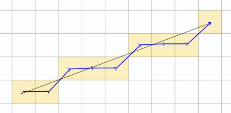
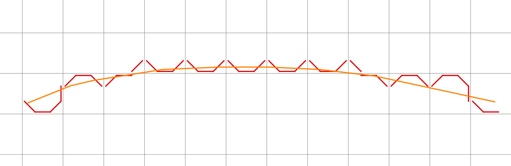
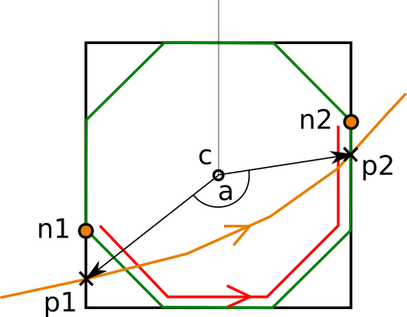
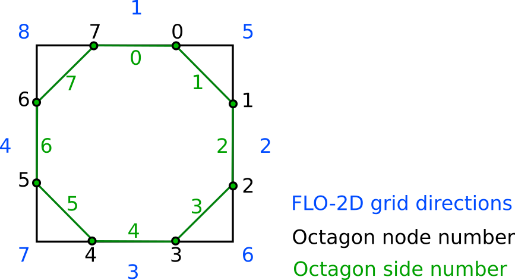

User Lines Schematization
=========================

For channels, levees and streets schematization the `Bresenham's
<https://en.wikipedia.org/wiki/Bresenham%27s_line_algorithm>`_ algorithm will be used.

Levee schematization
--------------------

User levee lines are schematized to follow grid octagons sides.

For each grid element with a levee line a pair(s) of entry (*p1*) and leave (*p2*) points are found and snapped to the nearest
octagon node (*n1* and *n2*).

Angle *a* between vectors *c-p1* and *c-p2* is calculated. If angle *a* is less than 180 deg, levee segments are drawn from
*n1* to *n2* in the counter-clockwise direction.
If *a* is more then 180 deg, segments are drawn in the clockwise direction.

FLO-2D grid directions and octagon numbering schema:

