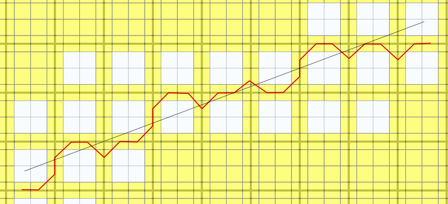

User Lines Schematization
=========================

.. figure:: img/channel_schemat.png
   :align: center

For channels, levees and streets schematization the `Bresenham's
<https://en.wikipedia.org/wiki/Bresenham%27s_line_algorithm>`_ algorithm will be used.

For levees the algorith could be based on a modified grid:

Some of the grid cells of that grid are not allowed.
