Creating a new model
====================

In the example below, it is assumed that user is generating a hydraulic model from scratch. First step to build a model, is to create a new database, where all the model files will reside.

Creating a new database
-----------------------
To create a new database:

* In QGIS, from the main menu **Plugins** > **Flo2D** > **Settings**
* A new window will appear:

	* Click on **Create**
	* In the new window, type in your database name and hit **Save**
	* Select the projection in the next window
	* Set the default **Grid cell size** and the **Manning's n**

* Click **OK**

As you can see, based on the projection, the plugin sets the appropriate unit (metres or feet).

.. figure:: img/CreateNewModelSettings.png
	:align: center
	:alt: Creating a new model database

	Creating a new model database

There should be new groups, subgroups and layers added to your QGIS layer tree.

The main sub-groups we will be interested in during the model build are:

* User Layers
* Schematic Layers

**User Layers** group consists of FLO-2D building blocks. Users can digitise, add and edit GIS and tabular data through these layers and tables. Once the data are prepared, there will be a function to assign or modify the underlying grid cells based on the inputs.

**Schematic Layers** are the processed information from the User Layers expressed in grid format and ready to be used in a FLO-2D simulation.

In the following sections, we will add various model elements and assign appropriate values.

Creating a new domain
---------------------

To create a new domain, you need to digitize a new polygon within the **Computational Domain** under **User Layers** group.

Digitizing and editing functions are carried out using the QGIS digitizing tools. For more information, how to use QGIS digitizing tools, `see QGIS manual <https://docs.qgis.org/2.14/en/docs/user_manual/working_with_vector/editing_geometry_attributes.html>`_

To add a Computational Domain:

* Right-click on the **Computational Domain** under **User Layers** in the layer tree and select |ToggleEditing| **Toggle Editing**
* From the Digitizing toolbar, click on |AddFeature| **Add Feature**
* Digitize the extent of the boundary and right-click to finish the polygon
* Once finished with the digitizing, the attribute table will appear:

	* Under **cell_size** type the appropriate cell size and click **OK**

* Save the edits and toggle editting back

.. |ToggleEditing| image:: img/mActionToggleEditing.png

.. |AddFeature| image:: img/mActionCapturePolygon.png

.. figure:: img/BoundaryLayerGeom.png
	:align: center
	:alt: Domain extent

	Domain extent

.. figure:: img/BoundarLayerAttrib.png
	:align: center
	:alt: Attribute table for the domain extent

	Attribute table for the domain extent

To create the grid for the domain, we need to:

* In QGIS from the main menu, **Plugins** > **Flo2D** > |CreateGrid| **Create grid**

The above function should automatically build a grid based on the geometry and attribute value (for cell size) you have defined in the previous step.

.. |CreateGrid| image:: img/create_grid.png

.. figure:: img/BoundaryLayerGrid.png
	:align: center
	:alt: Generated grid based on the model bounday layer

	Generated grid based on the model bounday layer

Assigning elevation to grids
----------------------------

To assign, elevation to a grid, you can load your terrain model in QGIS first. The plugin will use various GDAL methods for interpolating elevation values and assign them to the grid. `See this page <http://gdal.org/gdalwarp.html>`_ for more details of interpolation methods.

The **Grid elevation sampling** tool supports rasters from a different projection (CRS).

To interpolate elevation and assing them to the grid:

* In QGIS from the main menu, **Plugins** > **Flo2D**  > |SampleElev| **Sampling grid elevation**
* A new window will appear

	* Select your elevation raster from the loaded layers in QGIS or click on **Browse** to point to a raster
	* Define the NODATA
	* Select the interpolation method for sampling
	* To speed up your process, select **Multithread**
* Click **OK**

The above process should populate elevation values within the **elevation** column of your schematized grid.

.. |SampleElev| image:: img/sample_elev.png

Assining roughness layer
-----------------------

As default, all roughness values within the grid are set to the default value. To overwrite the default values with the ones from **Roughness** layer (see the previous setp), you can use  |SampleManning| tool.

To assign roughness values, you need to edit the **Roughness** layer under **User Layers**. Alternatively, you can use an existing vector layer (polygon) with roughness values as a source for Manning's *n* values.

In the example below, we use an existing vector layer.

.. |SampleManning| image:: img/sample_manning.png

.. figure:: img/RoughnessGeom.png
	:align: center
	:alt: Source layer with roughness values

	Source layer with roughness values

.. figure:: img/ProbeN.png
	:align: center
	:alt: Roughness probing dialog

	Roughness probing dialog

.. figure:: img/RoughnessGrid.png
	:align: center
	:alt: Grid with the assigned roughness values

	Grid with the assigned roughness values

.. figure:: img/BoundaryGridAttrib.png
	:align: center
	:alt: Grid attribute table with roughness values

	Grid attribute table with roughness values

Defining area and width reduction factor layers
-----------------------------------------------
User can digitize polygons for ARF and WRF under **Blocked areas** layer. No attribute layer is needed for the ARF and WRF.

By default, any digitized polygon will be used for both ARF and WRF calculation. If you want the polygon to affect only one of the parameters, you can open the attribute table and set the appropriate column to 1 or 0.

To generate the factors and apply them to the grid, you can use |awfarf| **Evaluate Reduction Factors** tool.

.. |awfarf| image:: img/eval_arfwrf.png

.. figure:: img/ArfWrfUserLayer.png
	:align: center
	:alt: Building within the Blocked area user layer

	Building within the Blocked area user layer

.. figure:: img/ArfWrfSchematicLayer.png
	:align: center
	:alt: Schematized ARF and WRF

	Schematized ARF and WRF

Adjusting grid elevation
------------------------
Often users need to adjust elevation of the grids by lowering or raising the DTM over an area. In the example below, we are going to lower the elevation of the grid, by 3 feet to provide extra storage within the floodplain. To do that:

- Toggle Editing for **Grid Elevation** layer under User Layers
- Digitize a polygon where you want to lower the elevation
- For the attribute table, type **-3** for the **correction** value
- Save the edits for the layer
- Run |AssignElevationFromPolygon| **Assign elevation from polygon** tool

.. |AssignElevationFromPolygon| image:: ../../../flo2d/img/sample_elev_polygon.png

Note that in the attribute table, you can either assign the exact **elevation**, or shift the existing values by the **correction**.

.. figure:: img/GridElevationGeom.png
	:align: center
	:alt: Creating polygon to adjust grid elevation

	Creating polygon to adjust grid elevation

.. figure:: img/GridElevationAttrib.png
	:align: center
	:alt: Assigning correction value

	Assigning correction value

.. figure:: img/GridElevationBefore.png
	:align: center
	:alt: Grid elevation before running the tool

	Grid elevations before running the tool

.. figure:: img/GridElevationAfter.png
	:align: center
	:alt: Grid values after running the tool

	Grid elevations after running the tool

Adding levees
-------------
Levees can be added to model in various forms. The plugin supports the following formats:

- Levee lines only: the levee geometry shape will be used to schematize the levee shape. Value from the attribute table will be used to adjust the schematized levees. This option is ideal for representing a levee with constant value.
- Levee lines and levee points: Ideally, levee points should be snapped to the levee lines. The module will use levee lines to schematize levee shapes. Values from levee point's table of attribute will be used for interpolation along the levee line. This feature allow users to represent levees with sloped profile.
- Levee polygon: functions as a selection polygon and assign the polygon values to the levees falling inside its area

In this example, we are going to digitize a levee with sloped profile (i.e. levee lines and levee points). To start with, we can adjust **Snapping options** in QGIS, to ensure levee points are snapped to the lines:

- In QGIS, from the main menu, select **Settings** > **Snapping Options ...**
- A new window will appear:
	- For **Layer selection** choose **All visible layers**
	- Set **Snap to** to **To vertex**
	- Set **Tolerance** to **10 pixels**
	- Click **OK**

Now that the snapping is set, we can turn off the unwanted vector layers and start digitizing **levee points** first:

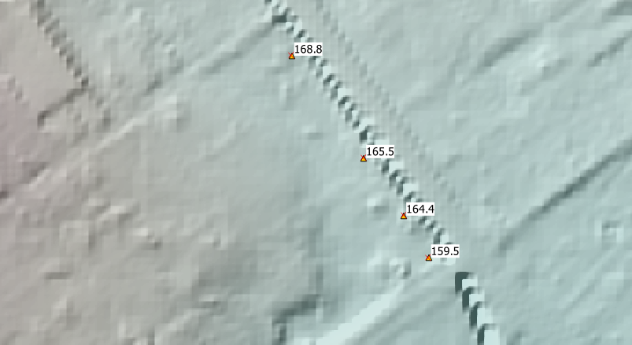

	Levee points in user layer

Now we can connect the points with line, digitized within the **levee line** under user layer:

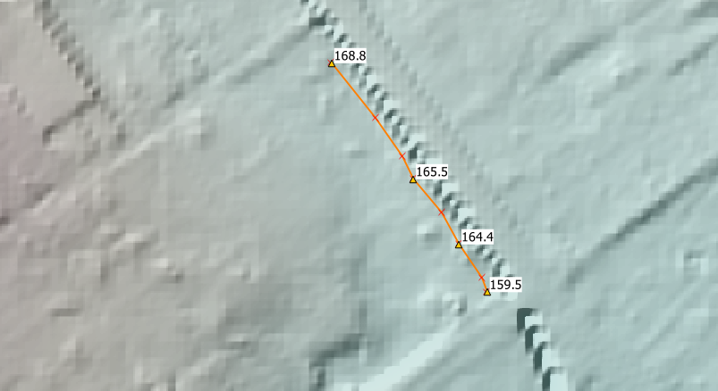

	Levee line in user layer

Note that levee line does not require any additional data, as the elevation source is from the snapped levee points.

We can now run |set_levee_elev| to schematize levees:

.. |set_levee_elev| image:: ../../../flo2d/img/set_levee_elev.png

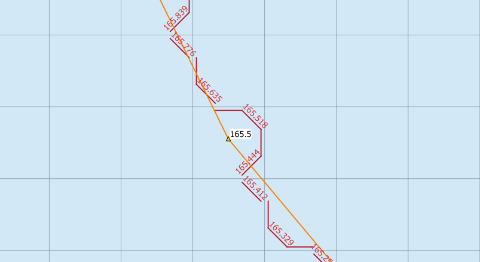

	Schematized levees

Adding streets
--------------
To add street, you can use the **Street Editor** from the FLO-2D dock widget to digitize and assign the appropriate parameters.

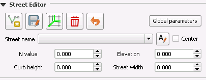

	The Street Editor

In this case, all the streets were imported from an existing vector layer and global parameters were assigned to all the lines.

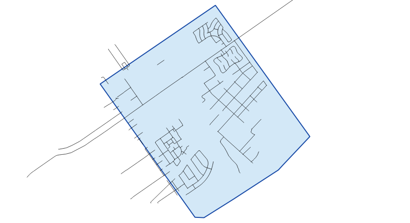

	User layer representing street lines

Once all the street lines are added, you can run |schematize_streets| **Schematize Streets** tool from the widget.

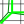

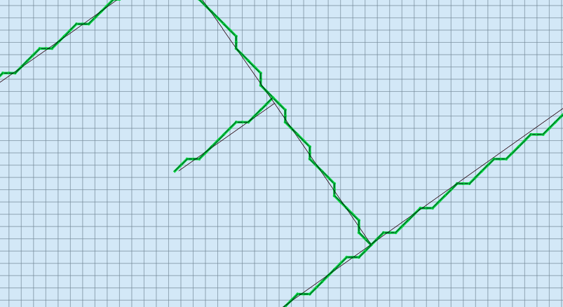

	Schematized street lines

Adding boundary condition
-------------------------
To add a boundary condition, we can use the **Boundary Condtion Editor** widget.

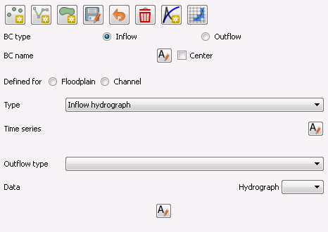

	The Boundary Condtion Editor

First you need to decide which type of geometry best represents your bondary condition location. Use |mActionCapturePoint| point, |mActionCaptureLine| line or |mActionCapturePolygon| polygon geometry to digitize the bounday condition location first. You should be able to select if you want to use the digitized feature as **Inflow** or **Outflow**.

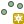

.. |mActionCaptureLine| image:: ../../../flo2d/img/mActionCaptureLine.png

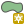

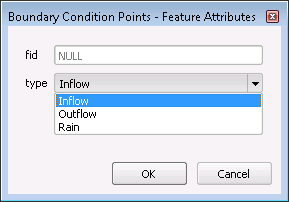

	Boundary condtion type

Once the geometry is added to the canvas and type is set, click on the |mActionSaveAllEdits| save icon to save your changes.

If this is your first inflow bounday, a default name of **Inflow 1** appear as its name. you can assign a **name** by clicking on |change_name| the change name tool.

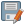

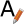

You can then define, if this bounday condition is going to be assigned to the floodplain or a channel. Ensure to click on |mActionSaveAllEdits| the save icon from the widget as you make changes.

Now that we have the location of the boundary and boundary type, a time series can be defined.

If this is your first boundary condition, an empty time series will be automatically created and assigned to the feature (**Time series 1**). You can rename the time series by clicking on |change_name| within the time series section.

There should be a tabular section, within your plugin panels, where you can enter time series. You can copy data from your spreadsheet or text editor and paste it within the tabular view. A plot of the time series should be automatically updated as you add data.

Note that the data is assumed to be in the correct system. For example, if you are in the SI, the time series for an inflow hydrograph is m:sup:`3`/s.

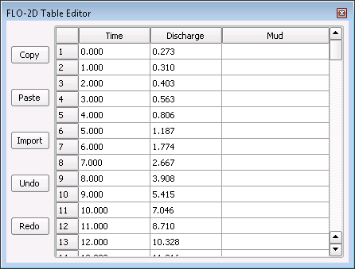

	Table Editor

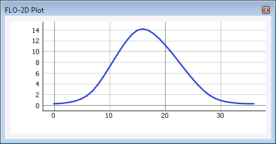

	Plot view of the tabular data

For the subsequent boundary condtion features, you can either use an existing time series or generate a new one by clicking on |add_bc_data| **Add Boundary Condition Data** tool.

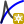

Once all the boundary condition data are added, you can click on |schematize_bc| **Schematize BC** tool to translate the user layer and tables to the schematic layers.

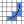

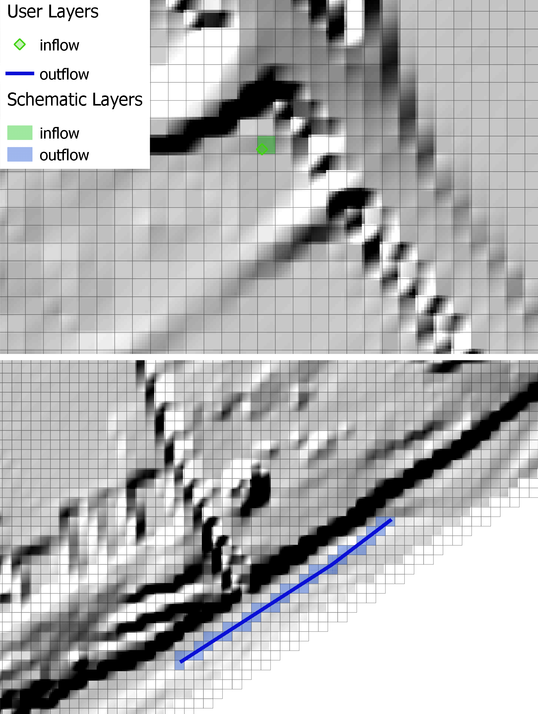

	Boundary condition user and schematic layers

Adding channels and cross sections
----------------------------------
Following elements are required to represent channels:

- Left bank line
- Surveyed cross sections

To add the left bank line, simply select the layer from the user layer list, toggle editing and digitize a new line using QGIS digitizing toolbar. The line should be in the direction of the flow (upstream to downstream). If the line represents the main channel, you need to fill in **rank** as **1** (see the confluence section for more).

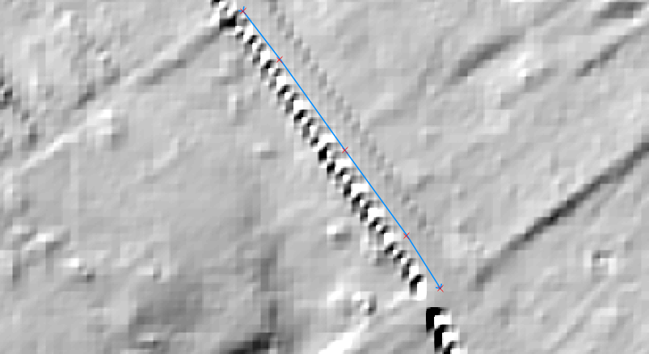

	Left bank user layer

The next step is to add suveyed cross sections. There is a widget within the plugin panel to help with adding section location (as a line), cross section type and cross section data.

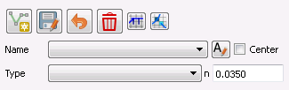

	The Cross-section Editor

To add a cross section,  click on |mActionCaptureLine| **Add cross section line** from the widget and digitize a section from left to right, looking downstream. Ensure the cross section line intersects with the left bank line.

**Important notes**

- Ensure the starting of the first surveyed cross section line and left bank line fall within the same cell
- Ensure cross sections intersect with the left bank

You can define the cross section type within the attribute table,  once the location line is digitized.

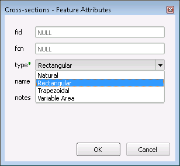

	The Cross-section feature attribute

Click on |mActionSaveAllEdits| save button from the widget after digitizing the section. You should be able to change the section name and type.

Cross section data (bank levels, width, depth or profile), can be added within the tabular editor panel. Note that the plot is only available for **Natural** cross section profiles.

Once, all the left banks and cross sections are added, you can run |schematize_xsec| **Schematize Cross-section** tool.

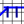

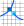

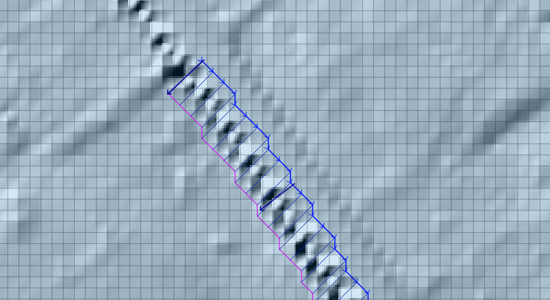

	Schematized channel and cross sections

To add a lateral channel, digitize a new left bank. The line should intersect with the main channel (with **rank = 1**) right bank or left bank.
Make sure, you assign **rank** value for the left bank of the lateral channel to be **2**. Add the surveyed cross sections for the lateral channel in the same way you did for the main channel. To generate the schematic layers, run |schematize_xsec| **Schematize Cross-section**.

You will then need to run |schematize_confluence| **Schematize Confluence** to generate schematic confluence points.

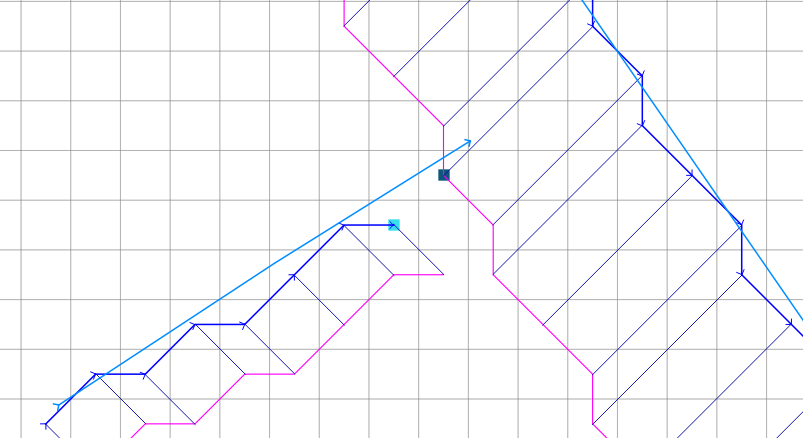

	Schematic layers for channel with confluence

Initial condition
-----------------
Users can assign initial condition to the floodplain and channel segments. To add initial condition (reservoirs) to floodplain, click on |add_reservoir| **Add reservoir** tool from the **Initial Condition Editor** panel.

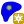

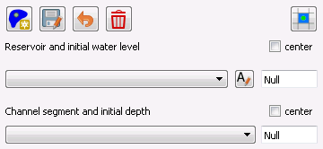

	The Initial Condition Editor panel

Digitize a point, where you want to apply the initail condition and assign a name and a value within the panel. Click on |schematize_res| to schematize the reservoir points.

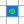

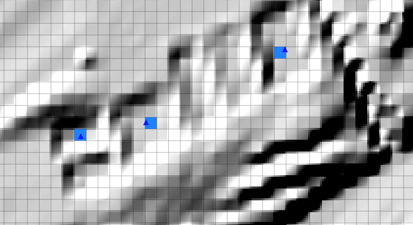

	User points for the initial condition (reservoirs) and schematized grids

Floodplain sections
-------------------

To add a floodplain cross section, click on |add_fpxs| from the **Floodplain Cross-section Editor** panel and digitize a line. Click on |mActionSaveAllEdits| save button and then assign a name and select a direction from the panel.

.. |add_fpxs| image:: ../../../flo2d/img/add_fpxs.png

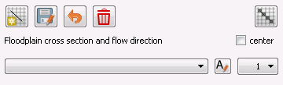

	The Floodplain Cross-section Editor panel

To schematize the floodplain sections, click on |schematize_fpxs| from the panel. You should be able to see the schematized floodplain grids and lines.

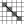

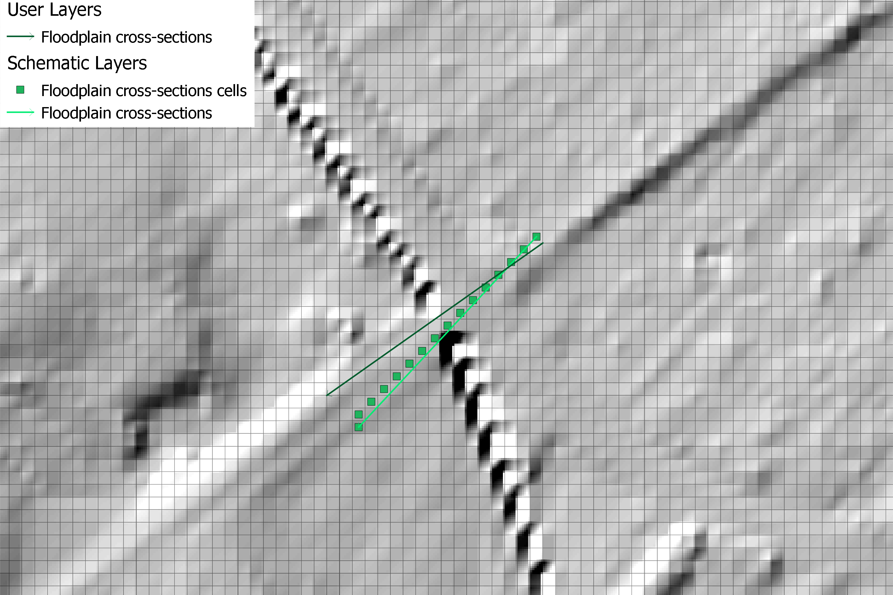

	User floodplain cross section and schematized floodplain layers
