Creating a new model
====================

In the example below, it is assumed that user is generating a hydraulic model from scratch. First step to build a model, is to create a new database, where all the model files will reside.

Creating a new database
-----------------------
To create a new database:

* In QGIS, from the main menu **Plugins** > **Flo2D** > **Settings**
* A new window will appear:

	* Click on **Create**
	* In the new window, type in your database name and hit **Save**
	* Select the projection in the next window
	* Set the default **Grid cell size** and the **Manning's n**

* Click **OK**

As you can see, based on the projection, the plugin sets the appropriate unit (metres or feet).

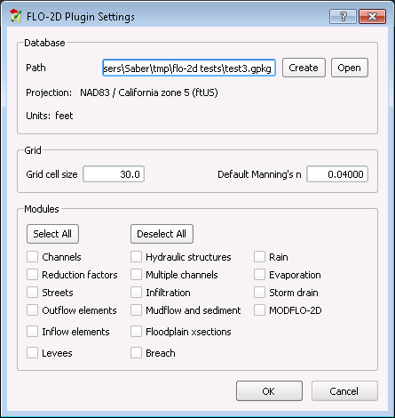

	Creating a new model database

There should be new groups, subgroups and layers added to your QGIS layer tree.

The main sub-groups we will be interested in during the model build are:

* User Layers
* Schematic Layers

**User Layers** group consists of FLO-2D building blocks. Users can digitise, add and edit GIS and tabular data through these layers and tables. Once the data are prepared, there will be a function to assign or modify the underlying grid cells based on the inputs.

**Schematic Layers** are the processed information from the User Layers expressed in grid format and ready to be used in a FLO-2D simulation.

In the following sections, we will add various model elements and assign appropriate values.

Creating a new domain
---------------------

To create a new domain, you need to digitize a new polygon within the **Computational Domain** under **User Layers** group.

Digitizing and editing functions are carried out using the QGIS digitizing tools. For more information, how to use QGIS digitizing tools, `see QGIS manual <https://docs.qgis.org/2.14/en/docs/user_manual/working_with_vector/editing_geometry_attributes.html>`_

To add a Computational Domain:

* Right-click on the **Computational Domain** under **User Layers** in the layer tree and select |ToggleEditing| **Toggle Editing**
* From the Digitizing toolbar, click on |AddFeature| **Add Feature**
* Digitize the extent of the boundary and right-click to finish the polygon
* Once finished with the digitizing, the attribute table will appear:

	* Under **cell_size** type the appropriate cell size and click **OK**

* Save the edits and toggle editting back

.. |ToggleEditing| image:: img/mActionToggleEditing.png

.. |AddFeature| image:: img/mActionCapturePolygon.png

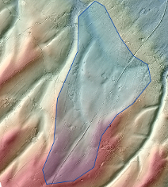

	Domain extent

.. figure:: img/BoundarLayerAttrib.png
	:align: center
	:alt: Attribute table for the domain extent

	Attribute table for the domain extent

To create the grid for the domain, we need to:

* In QGIS from the main menu, **Plugins** > **Flo2D** > |CreateGrid| **Create grid**

The above function should automatically build a grid based on the geometry and attribute value (for cell size) you have defined in the previous step.

.. |CreateGrid| image:: img/create_grid.png

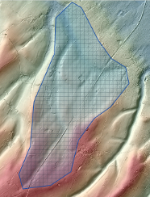

	Generated grid based on the model bounday layer

Assigning elevation to grids
----------------------------

To assign, elevation to a grid, you can load your terrain model in QGIS first. The plugin will use various GDAL methods for interpolating elevation values and assign them to the grid. `See this page <http://gdal.org/gdalwarp.html>`_ for more details of interpolation methods.

The **Grid elevation sampling** tool supports rasters from a different projection (CRS).

To interpolate elevation and assing them to the grid:

* In QGIS from the main menu, **Plugins** > **Flo2D**  > |SampleElev| **Sampling grid elevation**
* A new window will appear

	* Select your elevation raster from the loaded layers in QGIS or click on **Browse** to point to a raster
	* Define the NODATA
	* Select the interpolation method for sampling
	* To speed up your process, select **Multithread**
* Click **OK**

The above process should populate elevation values within the **elevation** column of your schematized grid.

.. |SampleElev| image:: img/sample_elev.png

Assining roughness layer
-----------------------

As default, all roughness values within the grid are set to the default value. To overwrite the default values with the ones from **Roughness** layer (see the previous setp), you can use  |SampleManning| tool.

To assign roughness values, you need to edit the **Roughness** layer under **User Layers**. Alternatively, you can use an existing vector layer (polygon) with roughness values as a source for Manning's *n* values.

In the example below, we use an existing vector layer.

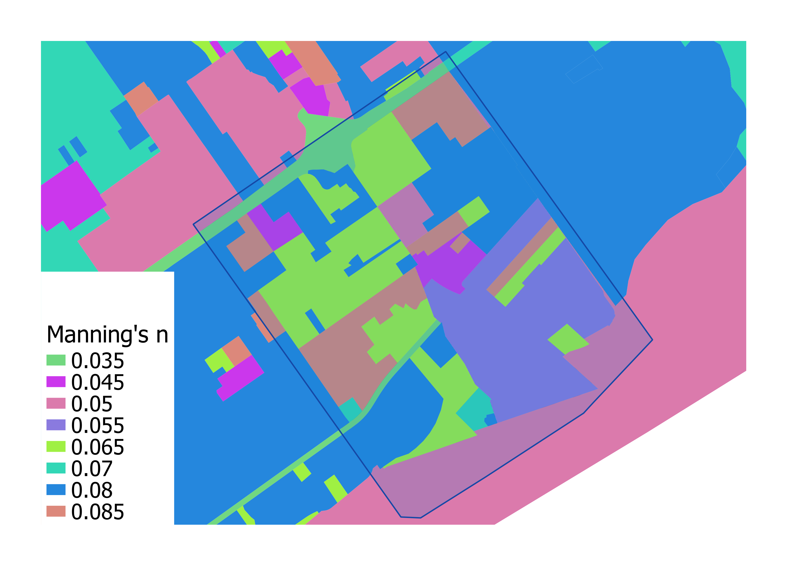

	Source layer with roughness values

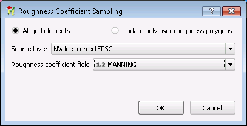

	Roughness probing dialog

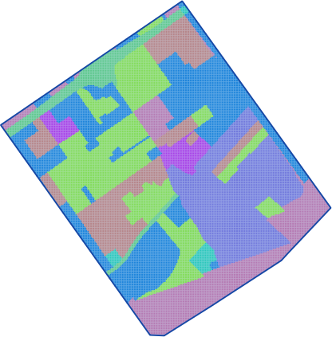

	Grid with the assigned roughness values

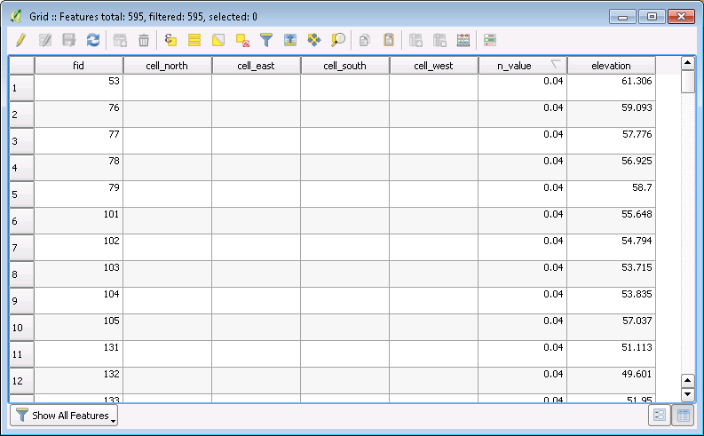

	Grid attribute table with roughness values

Defining area and width reduction factor layers
-----------------------------------------------
User can digitize polygons for ARF and WRF under **Blocked areas** layer. No attribute layer is needed for the ARF and WRF.

By default, any digitized polygon will be used for both ARF and WRF calculation. If you want the polygon to affect only one of the parameters, you can open the attribute table and set the appropriate column to 1 or 0.

To generate the factors and apply them to the grid, you can use |awfarf| **Evaluate Reduction Factors** tool.

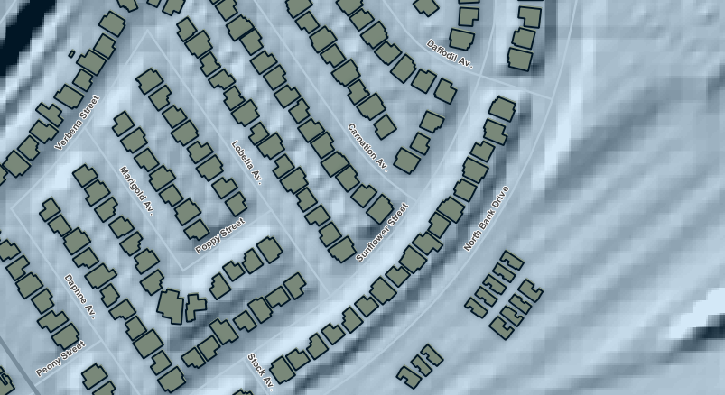

	Building within the Blocked area user layer

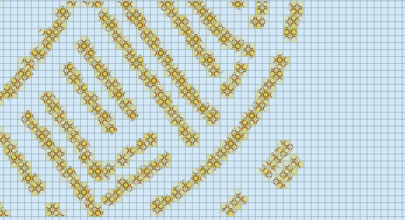

	Schematized ARF and WRF

Adjusting grid elevation
------------------------
Often users need to adjust elevation of the grids by lowering or raising the DTM over an area. In the example below, we are going to lower the elevation of the grid, by 3 feet to provide extra storage within the floodplain. To do that:

- Toggle Editing for **Grid Elevation** layer under User Layers
- Digitize a polygon where you want to lower the elevation
- For the attribute table, type **-3** for the **correction** value
- Save the edits for the layer
- Run |AssignElevationFromPolygon| **Assign elevation from polygon** tool

Note that in the attribute table, you can either assign the exact **elevation**, or shift the existing values by the **correction**.

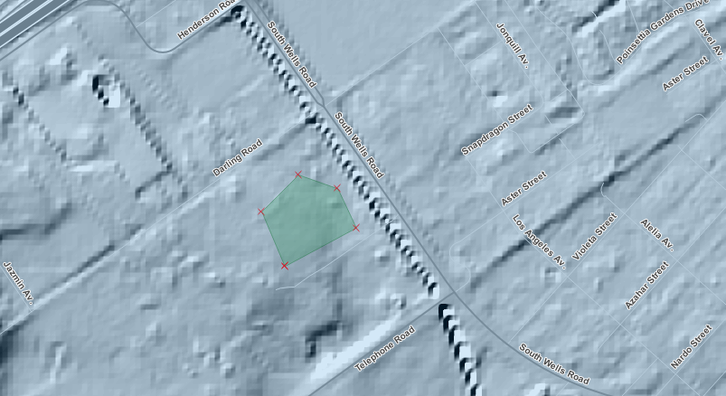

	Creating polygon to adjust grid elevation

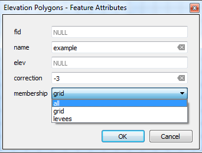

	Assigning correction value

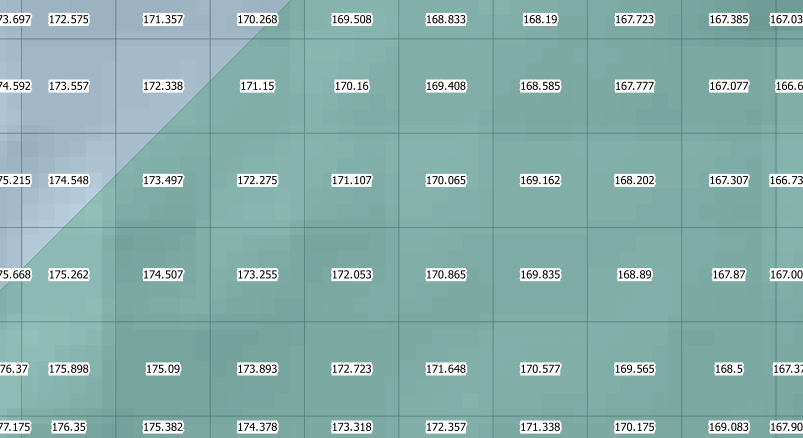

	Grid elevations before running the tool

	Grid elevations after running the tool
