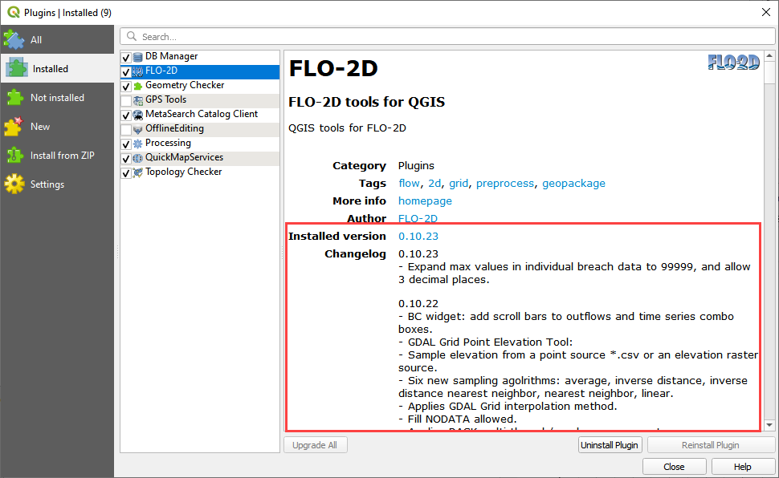

Installation Instructions
=========================

QGIS Installation – Stand Alone
-------------------------------

Download the QGIS Installer.
`www.flo-2d.com/qgis-plugin <http://www.flo-2d.com/qgis-plugin>`__

Run the installer and follow the installation instructions.
Use the default for all options.

Installing FLO-2D Plugin
------------------------

1. Download the
   Plugin zipped file `www.flo-2d.com/qgis-plugin-flo-2d <http://www.flo-2d.com/qgis-plugin-flo-2d>`__

2. Open Manage
   and install Plugins

3. Install the
   Plugin using the **Install from zipped file**

4. The Plugin
   is installed here:
   "C:\Users\user\AppData\Roaming\QGIS\QGIS3\profiles\default\python\plugins\flo2d"__

5. In QGIS,
   from the main menu, select *Plugins* >> *Manage and Install Plugins*

6. FLO-2D Plugin is listed and the toolbar will be visible.
   Make sure it is checked.

7. The Plugin
   window shows the version and change log.

If your QGIS window looks like this, you have installed the Plugin correctly.

.. image:: ../img/Installation-Instructions/Instal003.png

