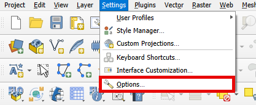
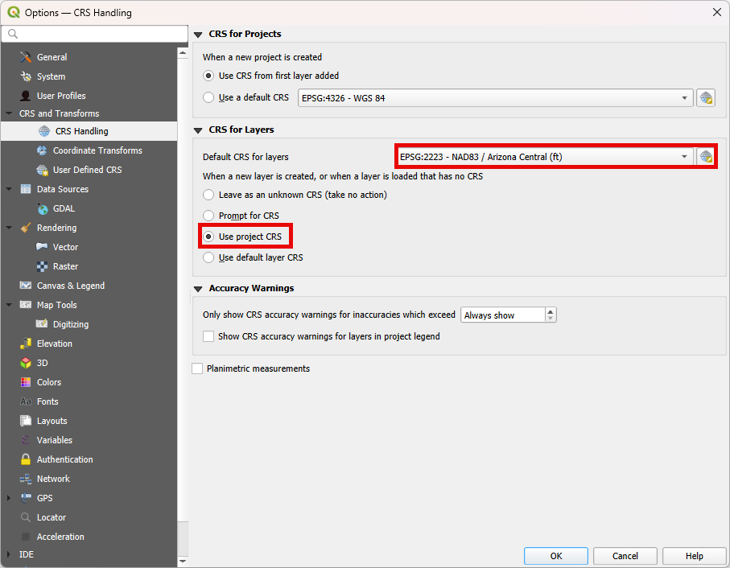
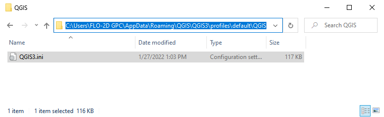
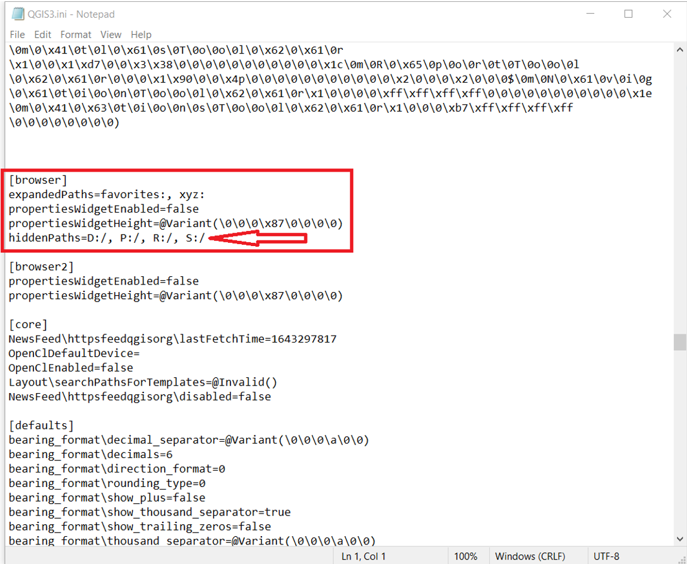
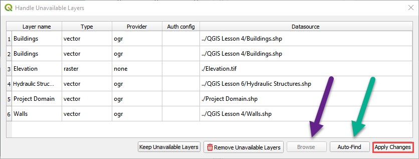

QGIS Tools
============

QGIS CRS Settings
-----------------

Preparing QGIS before initiating a project is essential. Simplify the addition of layers and file imports by
adjusting specific preferences. Streamline the process by setting up the
Coordinate Reference System (CRS) for imported layers.

1. Click Settings > Options.

2. Set the Default CRS to the coordinate system that is most commonly used.
   Select the Use project CRS radio button. See the following image for an
   example.

QGIS Browser Setting
--------------------

If QGIS freezes when opened, there is a potential fix in the qgis.ini file.  This simple fix will stop QGIS from trying
to read locked drives.

The file is found here: C:\\Users\\ACCT NAME\\AppData\\Roaming\\QGIS\\QGIS3\\profiles\\default\\QGIS

1. Open the file from the QGIS profile path.

2. Correct the file by adding the lines to qgis.ini file in any text editor as shown in the following image:

Project Path Changes
--------------------

Path corrections may be required if external layers were not added to the GeoPackage and the project folder was changed
or moved to a new computer.

-  Fix the external data links with the Handle Unavailable Layers
   window. Auto find works well. Apply Changes to close the window.

-  The Load Model window finds the GeoPackage and fixes the path. Click
   yes to load the model from the new path.

.. image:: ../img/QGIS-General-Tools/qgisgeneraltools8.png

