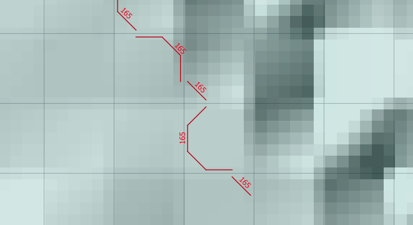

Overview
========
This user documentation provides steps to build a new model in QGIS using FLO-2D plugin.

Prerequisite
------------
Below is the list of software and prior knowledge requirements to work with the plugin efficiently and effectively.

GIS knowledge
^^^^^^^^^^^^^
It is assumed the user is generally familiar with GIS concepts (e.g. data type, coordinate reference system). In addition, user is advised to have a basic background in using QGIS platform. The following topics will help to quickly get up to speed with using QGIS:

- Loading vector/raster data
- Styling data
- Working with attribute tables
- Selecting data using expression
- Data management
  - Merging vector/raster data
  - Cropping data

- Spatial analysis
- Spatial queries
- Working with the Processing Toolbox
  - Creating surface from points
  - Converting raster to vector
  - Basic raster calculator
  - Creating slope/aspect from DTM
  - Basic hydrological assessment

QGIS version
^^^^^^^^^^^^
This plugin can be used in QGIS 2.18 or later versions.

Database structure
------------------
FLO-2D plugin stores all the model data in a Geopackage format. The database is split into 3 sections:
- User layers: all the geo-hydraulic information from user should be added through these layers
- Schematic layers: are the representation of the vector/raster data in grid format. User layers will be translated through various algorithms to schematic layers.
- Tables: contains tabular data.

It is advised to use the tools provided as a part of the plugin to manipulate the content of the database. Any changes, outside the plugin to the schematic layers and tables can be overwritten by FLO-2D modules.

Workflow
--------
User first creates a database. The database contains all the layers and tables to build a fully functional FLO-2D model.
All the input data should be added to the user layer through the widgets and tools in  QGIS and the ones provided through the plugin. Once user completes the data input, an appropriate module will be required to translate the data to the grid format.

The equivalent of the above process in QGIS is shown below:

- Digitizing User Levee Line:

.. image:: img/user_levee_lines.png
	:align: center
	:alt: User levee line

- Then running Levee Tool |set_levee_elev|
- The result as Schematized Levee Layer

Following user layers, algorithms and schematic layers are provided within the plugin:

+---------------------------------+---------------------+----------------------------------------+-----------------------------------------------------------------------------+
| Layer                           |Geometry type        |Processing module                       |Schematized layer                                                            |
+=================================+=====================+========================================+=============================================================================+
| Computational Domain            |Polygon              |Create Grid                             |Grid                                                                         |
+---------------------------------+---------------------+----------------------------------------+-----------------------------------------------------------------------------+
| DTM raster                      |Raster               |Sampling Grid Elevation                 |Grid                                                                         |
+---------------------------------+---------------------+----------------------------------------+-----------------------------------------------------------------------------+
| Roughness                       |Polygon              |Sampling Manning's n                    |Grid                                                                         |
+---------------------------------+---------------------+----------------------------------------+-----------------------------------------------------------------------------+
| Blocked areas                   |Polygon              |Evaluate Reduction Factor (ARF and WRF) |ARF_WRF                                                                      |
+---------------------------------+---------------------+----------------------------------------+-----------------------------------------------------------------------------+
| Grid Elevation                  |Polygon              |Assign Elevation from polygons          |Grid                                                                         |
+---------------------------------+---------------------+----------------------------------------+-----------------------------------------------------------------------------+
| Levee                           |Point, Line, Polygon |Assign Elevation from polygons          |Levees                                                                       |
+---------------------------------+---------------------+----------------------------------------+-----------------------------------------------------------------------------+
| Boundary Condition              |Point, Line, Polygon |Schematize boundary condtion            |BC cells, table                                                              |
+---------------------------------+---------------------+----------------------------------------+-----------------------------------------------------------------------------+
| Floodplain cross-sections       |Line                 |Schematize floodplain section           |BC cells, table                                                              |
+---------------------------------+---------------------+----------------------------------------+-----------------------------------------------------------------------------+
| Reservoirs                      |Point                |Schematize reservoirs                   |Reservoirs                                                                   |
+---------------------------------+---------------------+----------------------------------------+-----------------------------------------------------------------------------+
| Streets                         |Line                 |Schematize streets                      |Streets                                                                      |
+---------------------------------+---------------------+----------------------------------------+-----------------------------------------------------------------------------+
| Left Bank Lines, Cross sections |Line                 |Schematize Cross-sections               |Channel segments (left bank), Cross sections, Right Bank, Channel confluences|
+---------------------------------+---------------------+----------------------------------------+-----------------------------------------------------------------------------+
