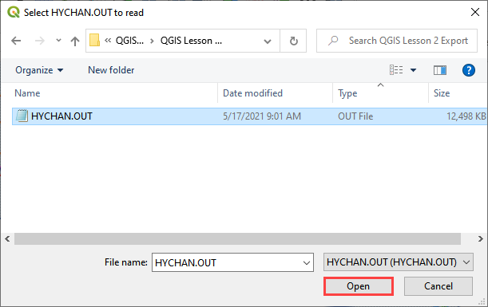
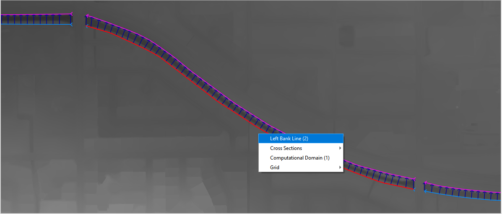
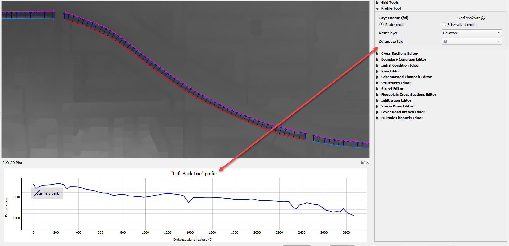
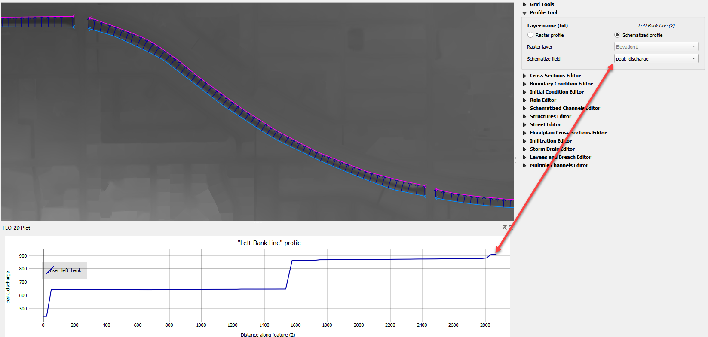
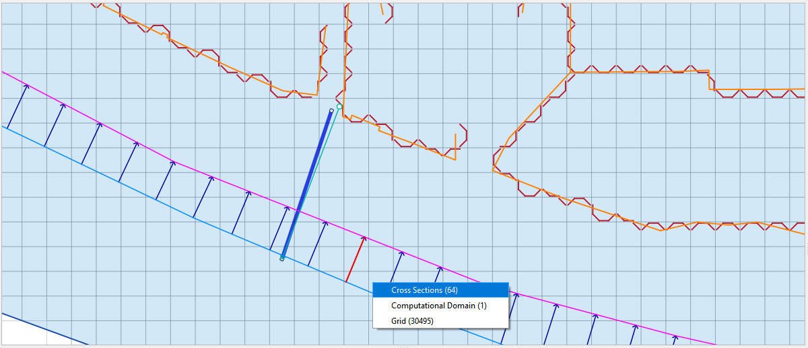
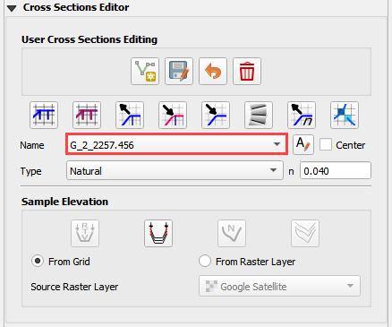
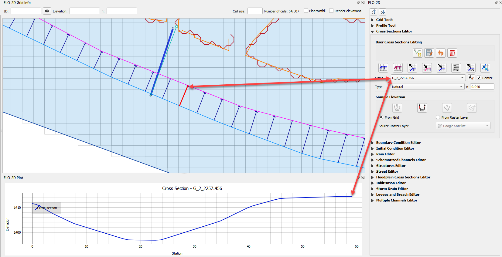
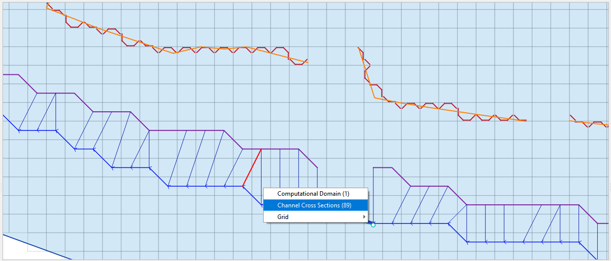

FLO-2D Info Tool
================

Use the Info Tool to identify data in the User Layers and Schematic Layers.
The layers must be active and checked on in the Layers Panel.
This tool also activates the Profile Tool Widget.

.. image:: ../img/Flo-2D-Info-Tool/Flo002.png

Layers that work with this tool:

-  Channel layers

-  Left bank

-  Cross sections

-  Structure layers

-  Levee layers

-  Storm drain layers

Load the Data
-------------

1. Start by loading the channel
   surface elevation and peak discharge from the HYCHAN.OUT file.

.. image:: ../img/Flo-2D-Info-Tool/Flo005.png

2. Select the
   file and click Open.

3. Make sure the Elevation raster
   is in the Layers group.  If it is missing, drag Elevation.tif onto the map from QGIS Lesson 1 folder.

Channel Profiles
----------------

1. Click  
   the FLO-2D Info Tool.

.. image:: ../img/Flo-2D-Info-Tool/Flo002.png

2. Click
   any left bank line.

3. The data will  
   load into the Profile Tool widget and the FLO-2D Plot panel.

4. Use the  
   Profile Tool widget to select the data plot source.

5. In this example, the  
   elevation raster is the y axis and the left bank length is the x axis.

.. image:: ../img/Flo-2D-Info-Tool/Flo003.png

6. Change the profile
   source from Raster to Schematic Layer and choose the water surface elevation.

7. In this example,
   the water surface elevation is the y axis.

.. image:: ../img/Flo-2D-Info-Tool/Flo004.png

8. Change the profile source to Peak Discharge.

Channel User Layer Cross Sections
--------------------------------------

1. Click the FLO-2D
   Info tool.

.. image:: ../img/Flo-2D-Info-Tool/Flo002.png

2. Click and select
   a User Layer cross section.

3. This cross  
   section is loaded into the Cross Section Editor widget.

4. This cross
   section is also loaded into the FLO-2D Plot panel.

Channel Schematic Layer Cross Sections
--------------------------------------

1. Click the FLO-2D
   Info tool.

.. image:: ../img/Flo-2D-Info-Tool/Flo002.png

2. Click and
   select a Schematic Layer cross section.

3. This cross  
   section data is loaded into a dialog box.

.. image:: ../img/Flo-2D-Info-Tool/Flo13.png

Structure Layers
----------------

1. Click
   the FLO-2D Info tool.

.. image:: ../img/Flo-2D-Info-Tool/Flo002.png

2. Click and
   select a structure line.

3. This line is loaded
   into its editor and plotted.

.. image:: ../img/Flo-2D-Info-Tool/Flo006.png
