Hazus Tool
==========

The Hazus tool is used to generate water surface elevation or flow depth
rasters for the FEMA Hazus program.

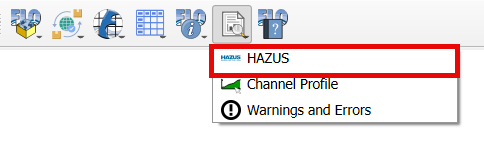

Building Layer
--------------

1. Add building
   layer from a shapefile.

2. Click Open
   Data Source Manager button.

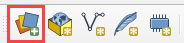

3. Navigate to
   the building shapefile and add it to the map.

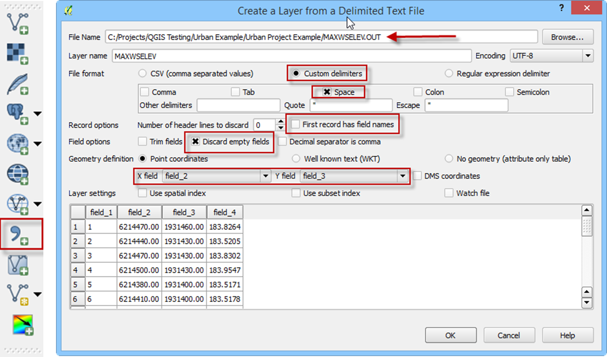

Import Depth and Water Surface Layers
--------------------------------------

1. Add a depth
   layer and a water surface layer.

2. Click Open
   Data Source Manager button.

3. Fill the form as shown in
   the following image:

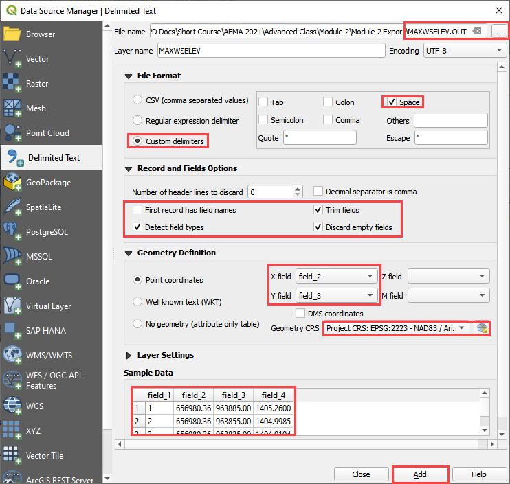

4. Repeat this process
   for the DEPFP.OUT file.

Assign Water Elevation and Depth to the Grid Layer
--------------------------------------------------

1. On the Grid Tools widget select
   the Assign water elevations/flow depths to grid from points layer button.

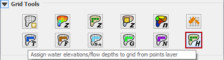

2. Edit the dialog box as
   shown below and click the Assign to selected grid field button.

.. image:: ../img/Hazus-Tool/hazustool7.png

3. Click OK to
   close the dialog box.

.. image:: ../img/Hazus-Tool/hazustool8.png

4. Repeat the process
   for the Depth layer.

5. On the Grid Tools
   widget select the Assign water elevations/flow depths to grid from points layer button.

   

6. Edit the dialog box as
   shown below and click the Assign to selected grid field button.

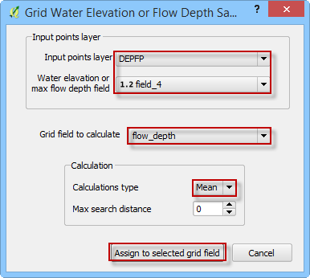

7. Click OK to
   close the dialog box.

.. image:: ../img/Hazus-Tool/hazustool8.png

Intersect Building Layer to Grid
--------------------------------

1. Use the QGIS Vector
   Menu to set up the intersection. Click Vector>\ GeoProcessing Tools>\ Intersection.

.. image:: ../img/Hazus-Tool/hazustool10.png

   
2. Set up the intersection dialog
   box as shown below. Click Run to make the intersection. This process adds the Intersection layer to the map automatically.

.. image:: ../img/Hazus-Tool/hazustool11.png

Review Intersection Layer
-------------------------

1. The new Intersection layer
   has fields from both the Buildings and Grid layers:

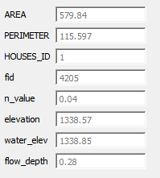

2. Each building polygon that intersects
   the grid has several partitions (polygons) with different elevations.
   The following building has 7 partitions with different data from each grid:

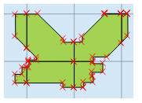
   

3. Each partition of the building has,
   different field values. For example, HOUSE_ID “1” in the Features Table,
   has different ‘elevation’, ‘water_elev’, and ‘flow_depth’:

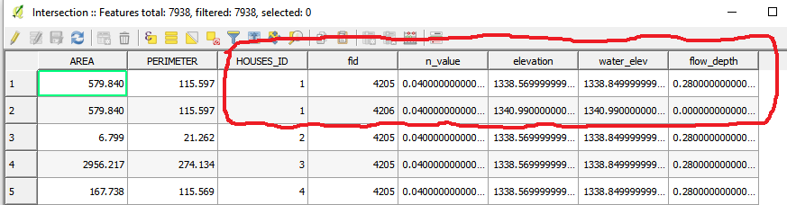
  

Homogenize the Intersection Layer
----------------------------------

1. Select the HAZUS
   button in the FLO-2D Toolbar.

2. Fill the dialog box as
   shown below and click the Compute and Show Building Statistics button.

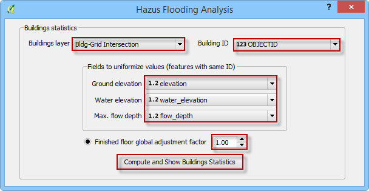

**Note: The ‘Finished floor global adjustment factor’ value will be added
to the ground elevations, if selected.**

3. Click OK to close
   the message dialog box.

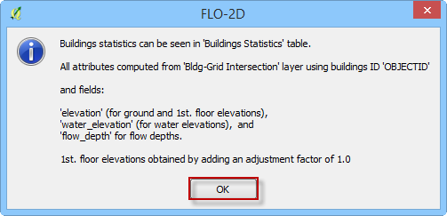

4. The Hazus tool calculates the
   statistics of the buildings polygons. It computes the following data for each building.

-  Ground elevation (min, max, mean);

-  First floor elevation (min, max, mean);

-  Water surface elevation (min, max, mean);

-  Depth (min, max, mean).

.. image:: ../img/Hazus-Tool/hazustool18.png

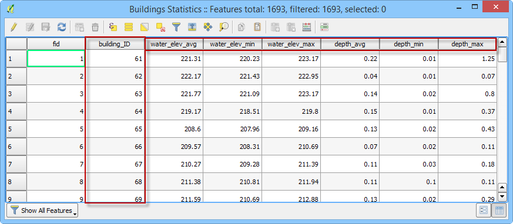

Join Building Statistics Table to Building Polygons
---------------------------------------------------

1. Right click the Buildings
   layer and click Properties. Add a Join to the layer. Click OK and Close the Properties window.

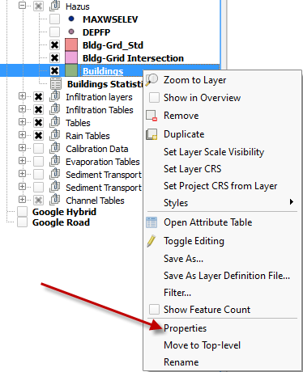
 

.. image:: ../img/Hazus-Tool/hazustool21.png

2. Save the Buildings Layer to a
   shapefile. Select the Save As… to a location and name the file.

**Note: The style of this new layer can be edited to help the user review
the data. The attributes can be sorted and arranged to help track
outliers or bad data. Use the field calculator to perform additional
statistical analysis on the data in this layer.**

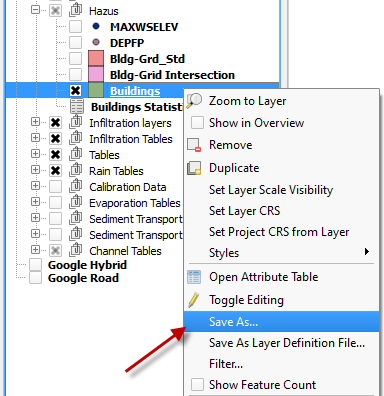

.. image:: ../img/Hazus-Tool/hazustool23.png

3. Now, the Buildings Shapefile
   has “join” fields from the Buildings Statistics table:

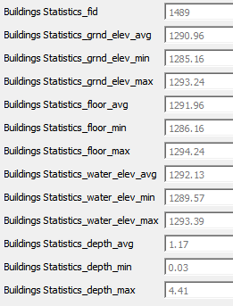

Rasterize the Buildings
-----------------------

1. On the Main QGIS Menu,
   click Processing>\ Toolbox.

.. image:: ../img/Hazus-Tool/hazustool25.png

2. Enter the search term Rasterize
   in the Processing Toolbox search field. Double click the Saga Rasterize tool. Saga>Raster Creation Tools>Rasterize.

.. image:: ../img/Hazus-Tool/hazustool26.png

3. Change the dialog
   box as shown below and click Run.

.. image:: ../img/Hazus-Tool/hazustool27.png

4. This example uses 10 ft. pixel resolution.
   The user can change this value to the desired resolution to better fit the buildings.
   This raster can be used with the FEMA Hazus software. Any other rasters that Hazus
   requires can be generated with the same methodology.

.. image:: ../img/Hazus-Tool/hazustool28.png