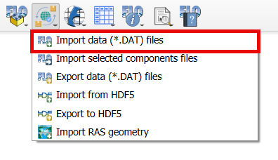
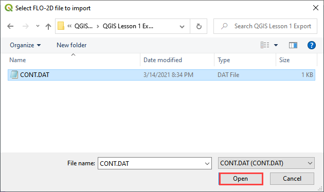
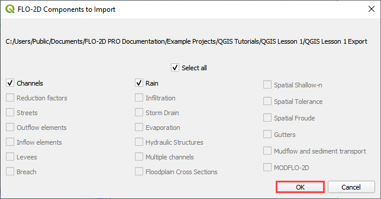
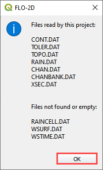

Import FLO-2D Data Files
=========================

Import the FLO-2D \*.DAT files into the Project
-------------------------------------------------

If a project already exists but it does not have \*.qgz or \*.gpkg file,
create one and import the project using this process.

Before performing this task, set up a GeoPackage using `FLO-2D Plugin
Settings <toolbar/FLO-2D%20Settings.html>`__.

1. To import a FLO-2D data
   files into a GeoPackage:

2. Click the
   Import FLO-2D Data Files

3. Navigate to
   the FLO-2D \*.DAT files

4. Select CONT.DAT
   and click Open.

5. All FLO-2D files are
   imported to the Plugin with this option.

6. Choose the \*.DAT files
   to import and click OK.

7. Once the project import is complete,
   this message will appear. Click OK to
   close the message.

8. The final step is to convert
   the new layers to User Layers. See
   `Convert Schematic Layers to User Layers. <Schema%202%20User.html>`__
