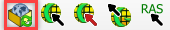
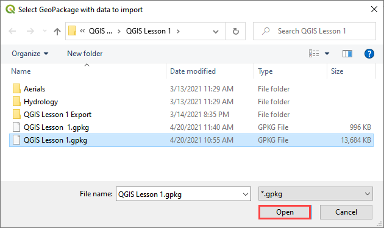
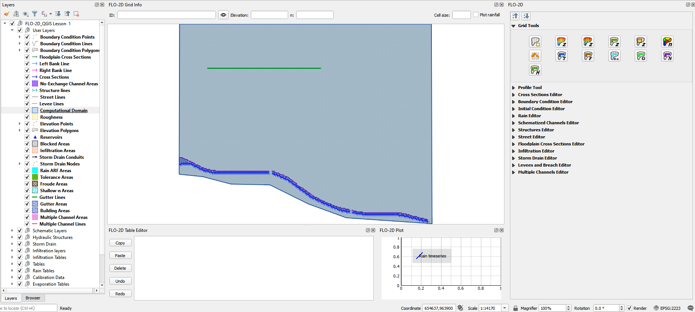

Import a Geo Package
=====================

When the FLO-2D Plugin is updated, the Geo Package structure changes. The
project can no longer be opened in the standard method described in the
previous section.

To Update a Geo Package:
--------------------------

1. Set up a new project (see `FLO-2D Plugin Settings <Flo-2D%20Settings.html>`__). This will build
   the new Geo Database.

2. Select the
   Import from Geo Package button from the FLO-2D Toolbar.

3. Navigate to the location of the Geo Package and click Open. This will
   import the old data into the new format.

4. When the import is complete, the project will be loaded with no error
   messages.

