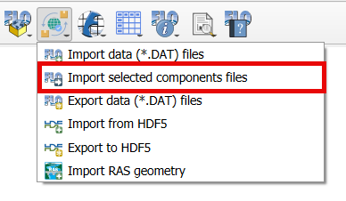
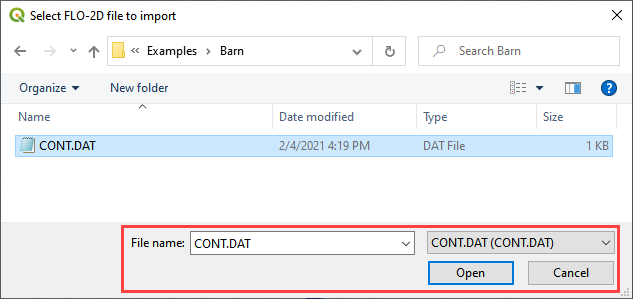
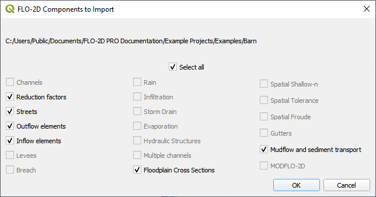
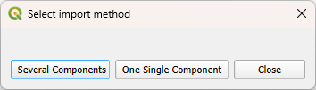

Import Selected Component Files
================================

1. Click the
   Import FLO-2D Component Files button.

2. Navigate to
   the FLO-2D \*.DAT files.

3. Select CONT.DAT
   and click Open.

4. Only selected
   components will be added using this feature.

5. The GeoPackage
   will not be overwritten.

6. Select the
   FLO-2D Components to load into the project.

