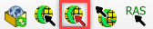

Import Selected Component Files
==============================================

1. Click the
   *Import GDS Files* icon.

2. Navigate to
   the FLO-2D \*.DAT files.

3. Select CONT.DAT
   and click *Open*.

4. Only selected
   components will be added using this feature.

5. The GeoPackage
   will not be overwritten.

.. image:: ../img/Imported-Selected-Component-Files/import002.png

6. Select the
   FLO-2D Components to load into the project.

.. image:: ../img/Imported-Selected-Component-Files/import003.png

.. |import004| image:: ../img/Imported-Selected-Component-Files/import004.png
