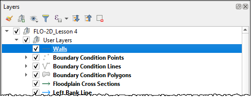
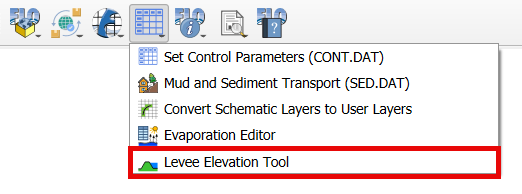
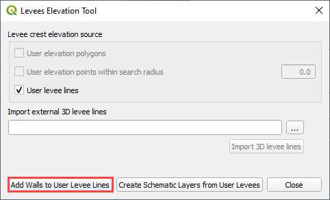
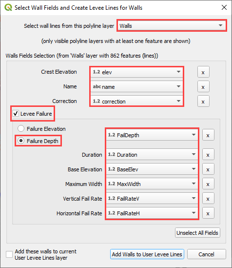
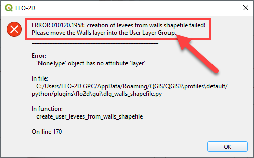
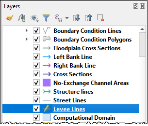
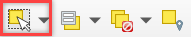
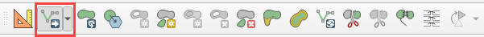
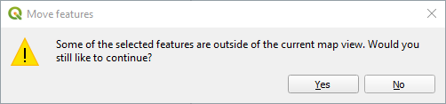

Levee Tool Walls
================

Create Walls Shapefile
______________________

Digitize a wall shapefile to represent the walls that will make a
significant impact to the flooding in an urban development. This means
representing wall that may prevent flooding in a neighborhood or walls
that may cause flooding by trapping water. The depth and velocity vector
maps can help identify walls that are hydraulically significant.

Shapefile Properties
--------------------

Walls that have the potential for failure due to collapse should also be
identified. The shapefile must have polyline geometry and should have
the following attributes:

-  Name – feature name (string) (required)

-  Elevation – crest elevation (float) (required)

-  Correction – elevation correction (float) (NULL ok)

-  Fail elevation or fail depth (float) (NULL ok)

-  Duration (float) (NULL ok)

-  Maximum fail width (float) (NULL ok)

-  Vertical fail rate (float) (NULL ok)

-  Horizontal fail rate (float) (NULL ok)

.. image:: ../img/Walls/walls1.png

In the case of walls, the failure data is usually set to default = 0 because they collapse when
the fail depth or fail elevation is achieved.  For walls, the only required failure data is the
failure elevation or failure depth.  All other failure values can be zero.  It is not necessary
to use failure data for every wall feature.  If the failure elevation or failure depth is NULL,
the failure for that wall will be ignored.

Add Walls to Levee Lines
------------------------

1. Move the
   Walls shapefile to the top of the User Layers.

 
2. Click the Levee
   Tool and click the Add walls to User Levee Lines.

3. Fill the Walls dialog
   box and click with the appropriate layers and
   click Add Walls to User Levee Lines.

4. If other levees already exist, check the Add these walls to current
   User Levee Lines layer.

5. If the walls are added to the layer successfully, the following image
   will appear.

.. image:: ../img/Walls/walls6.png

6. Go to `Levee <Levee%20Tool.html>`__ from Levee User Lines above to
   complete the walls by schematizing them.

Troubleshooting
---------------

1. Duplicate levees are features that can cause errors in FLO-2D. The
   Levee Tool will analyze duplicate levees and remove the levee with
   the lowest crest elevation. This process is automatic. The duplicate
   levee data is saved to the Layers List so it can be analyzed for
   potential modifications.  The Plugin should remove duplicate levees
   automatically.

.. image:: ../img/Walls/walls7.png
 
2. Crest elevation is another potential source for a fatal error for
   FLO-2D. If a levee or wall crest is lower than an adjacent grid
   elevation, the FLO-2D engine will stop with a fatal error message and
   the erroneous elevations are reported to the error.chk file. The Plugin
   can validate elevations using the debug options. See Debug section
   for instructions.

3. If the Walls layer is not in the User Layers, the following error
   will appear. Move the Walls Layer into User Layers and try again.

4. If the project is old, it will be necessary to import the old gpkg
   into a new gpkg. This error will appear.

.. image:: ../img/Walls/walls9.png

5. If a levee line is exactly aligned with a grid element side or
   corner, the following error will appear. Bear in mind that the On
   line 1675 may change with new versions of the Plugin.

.. image:: ../img/Walls/walls10.png

6. For large projects, it can be difficult to find all these locations.
   It is easier to move all the levee lines 1ft or less to any
   orthogonal direction. In this example the shift is made 0.5 ft to the
   southeast.

7. Click the Levee Lines and
   click the Editor Pencil.

8. Use the Select Features
   Tool to select all User Levee Line features.

9. Use the Advanced Digitizing Toolbar to Move all features. Click the
   Move Features tool.

10. Zoom in on one vertex of any Levee Line feature. Click the vertex.
    Click Yes to acknowledge that all features will be moved.

11. Move the mouse slightly to the southeast and click again. Save the
    edits and run the Schematize Levees again.

.. image:: ../img/Walls/walls16.png

