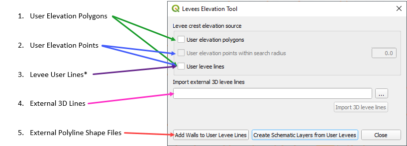
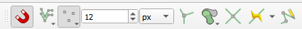
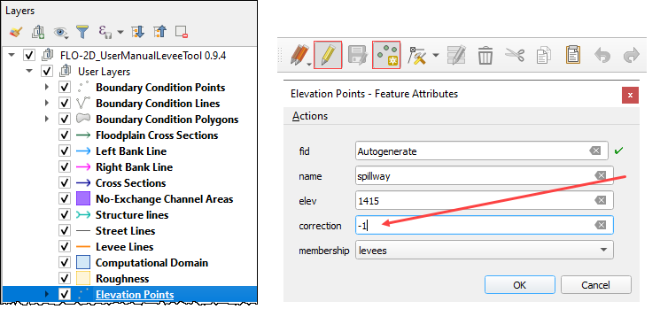
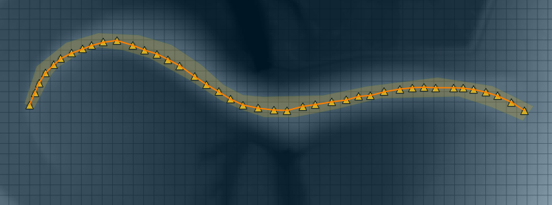
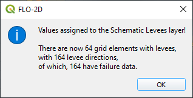
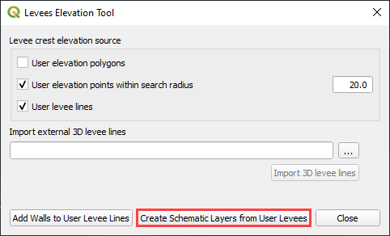
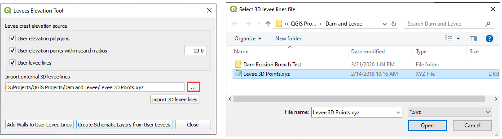
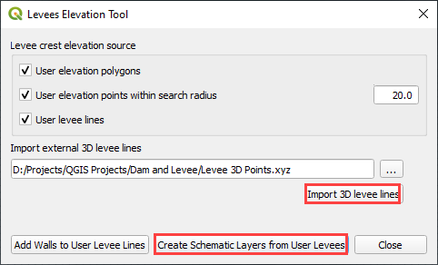

Levee Elevation Tool
=====================

.. image:: ../img/Buttons/Leveetool.png
 
The Levee Elevation Tool will create levees, berms, walls and dams. It
uses data from 5 sources:

The method to create levees or dams from each source is outlined below.

Create Levee Lines
------------------

1. Start by creating a Levee Line any place where a levee should be
   positioned.

2. Select the Levee Lines layer in User Layers and toggle the Edit
   Pencil.

3. Click the Add a Line Feature button and add a polyline to the center
   crest of the levee.

4. Right
   click anywhere after the last vertex to close the line.

5. Assign a levee crest elevation for a
   uniform levee.

6. If a correction is used, it will be added to the elevation field.
   If a negative correction is used, it will be subtracted from the crest elevation.
   The correction field is not mandatory.

7. Failure data is not
   needed at this time.  Leave it NULL.

.. image:: ../img/Levee-Tool/leveetool3.png

.. image:: ../img/Levee-Tool/leveetool9.png

.. image:: ../img/Levee-Tool/levee001.gif

Create a Levee Polygon
----------------------

1. Digitize a polygon feature in the
   Elevation Polygons layer.

2. Select the Elevation Polygons layer
   and click the Toggle Editing
   pencil.

3. Click the
   Add Polygon Feature, draw a polygon, and assign the levee crest elevation.

4. The levee line feature must also be present for the levee position to
   be applied.

5. See
   `Create Levee Lines <#create-levee-lines>`__.

.. image:: ../img/Levee-Tool/leveetool10.png

.. image:: ../img/Levee-Tool/leveetool11.png

.. image:: ../img/Levee-Tool/leveetool002.gif

Create Levee Points
-------------------

1. Digitize points
   feature in the Elevation Points layer.

2. Select the Elevation Points layer and click the Toggle Editing
   pencil.

3. Create a series of points and assign the levee crest elevation.

4. Turn on Snapping so the points will snap to the levee line.
   If the Snapping toolbar is missing, right click the tool bar area and add it from the menu.

5. The levee line feature must also be present for the levee position to
   be applied. See the instructions above.

6. In this example, a correction was applied to a location where a
   spillway was designed.

7. The points tool is more useful to assign a variable crest elevation.
   See the animation below to see how the points can change the elevation of
   a levee.

.. image:: ../img/Levee-Tool/levee003.gif
  

Levee from Elevation Polygon
----------------------------

.. image:: ../img/Buttons/Leveetool.png

The polygon layer is also used to define a uniform elevation for a
levee.

1. Click the
   Levee Elevation Tool button.

2. Select User elevation
   polygons and User levee lines.

3. Click Create Schematic Layers
   from User Levees.

4. The Plugin will build the levee into a schematic layer, set the
   elevation data for the crest and apply a correction if used.

5. The data can be
   reviewed in the attribute table of the levee layer.

6. The Levee user lines will be used to set crest elevations where
   polygons are not covering the levee.

Levee from Elevation Points within Search Radius
------------------------------------------------

.. image:: ../img/Buttons/Leveetool.png

1. Click the
   Levee Elevation Tool button.

2. Select User elevation points
   within search radius and User levee lines.

3. The plugin will schematize the Levee Lines layer,
   set the interpolated elevation data for the crest and apply a correction if used.

4. The levee crest
   elevation is interpolated between any two points.

Levee from Levee User Lines
---------------------------

.. image:: ../img/Buttons/Leveetool.png

1. Click the
   Levee Elevation Tool button.

2. Select User
   levee lines.

3. The plugin will schematize the Levee Lines layer,
   set the uniform elevation data for the crest and apply a correction if used.

.. image:: ../img/Levee-Tool/leveetool18.png

Levee from Import External 3D Levee Lines
-----------------------------------------

.. image:: ../img/Buttons/Leveetool.png

1. The levee data comes from an external point text file with a \*.xyz
   extension:

-  X coordinate of the center of the levee crest

-  Y coordinate of the center of the levee crest

-  Z crest elevation of the levee

2. The levee points should be in order from one side of the levee to the other.
   The direction or starting point is not important so long as the levee points
   are in order from the start point of the levee to the end point.
   Two levees should be separated by a blank line (text file carriage return).

.. image:: ../img/Levee-Tool/leveetool19.png

3. Call the levee data from the Levee Elevation Tool by clicking the “…”
   button under Import external 3D lines.

4. Once the data is
   identified, click the Import 3D levee lines button.

5. The imported levees are written to the elevation points and Levee
   Lines User Layer. Click Create Schematic Layers from User Levees to
   schematize the levee.

