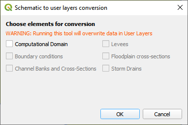

User to Schematic Converter
============================

This button may help convert User Layers to Schematic Layers.
It’s functionality is limited to very simple projects.
Be careful when using it.
Always make a recovery *.gpkg file.

   

1. This button 
   will update some layers if the grid element size or project domain is updated.

2. Click the  
   Convert User Layers to Schematic Layers button.

3. Choose the  
   layers to be updated.

4. This tool  
   will write the User Layers to Schematic Layers.

