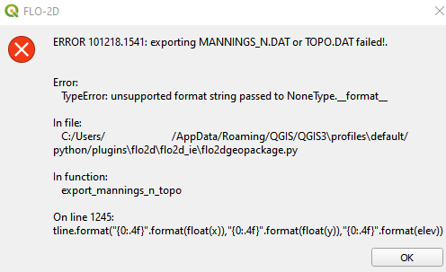

Export data (\*.DAT) files
===========================

This tool exports the FLO-2D \*.DAT files.

Export FLO-2D \*.DAT Files
---------------------------

.. note:: Set the Control Variables switches before running the Export tool.
          See `Set Control Parameters (CONT.DAT) <../flo-2d-parameters/Control%20Variables.html>`__.

1. Click
   the Export data (\*.DAT) files button.

.. image:: ../../img/Buttons/exportproject.png

2. Navigate to
   the project folder and click Select Folder.

.. image:: ../../img/Export-Project/exportproject3.png

3. Select the
   components that will be exported by checking or unchecking the
   files to be exported and click OK.

.. image:: ../../img/Export-Project/exportproject2.png

.. note:: It is not necessary to export all files every time.
          Export large files like INFIL.DAT or TOPO.DAT only when needed.

Troubleshooting
---------------

1. If data is missing from the grid table, this message will appear. This happens when the elevation raster, roughness
   polygon, or roughness raster do not cover the whole grid.

