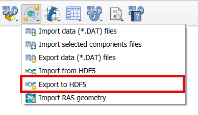

Export to HDF5
=================

This tool exports FLO-2D files into an HDF5 file.

Export the FLO-2D files into a HDF5 file
-----------------------------------------

.. note:: Set the Control Variables switches before running the Export tool.
          See `Set Control Parameters (CONT.DAT) <../flo-2d-parameters/Control%20Variables.html>`__.

1. Click the
   Export to HDF5.

2. Navigate to
   the export folder, set the file name, and click Save.

.. image:: ../../img/Export-to-HDF5/exporthdf5001.png

3. A message at the QGIS toolbar will show that the file was correctly exported.

.. image:: ../../img/Export-to-HDF5/exporthdf5002.png