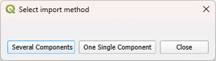
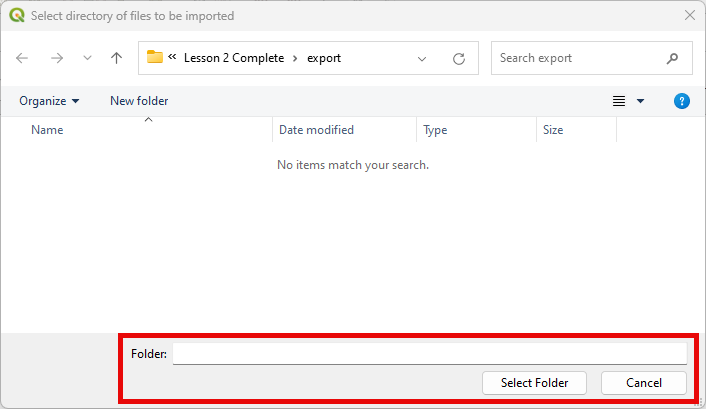

Import selected component files
================================

This tool imports selected FLO-2D \*.DAT file into the FLO-2D GeoPackage.

Import selected component files
--------------------------------

1. Click the
   Import selected components files button.

.. image:: ../../img/Buttons/importdatared.png

2. A message asking for importing Several Components or
   One Single Component will appear.

Several Components
-------------------

3. If the Several Components option is selected,
   navigate to the FLO-2D folder containing the \*.DAT files.

4. Select the folder that contains the FLO-2D \*.DAT files

5. Select the
   FLO-2D Components to load into the project.

.. image:: ../../img/Imported-Selected-Component-Files/import003.png

One Single Component
----------------------

3. If the One Single Component option is selected,
   select the desired \*.DAT file to import into the project.

