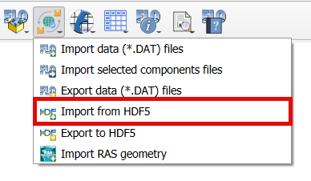

Import from HDF5
=================

This tool imports an existing FLO-2D \*.HDF5 file into the FLO-2D GeoPackage.

Import FLO-2D data from HDF5 file
----------------------------------

.. note:: Before performing this task, set up a FLO-2D Project GeoPackage using `New FLO-2D Project
          <../flo-2d-project/New%20FLO-2D%20Project.html>`__.

1. Click the
   Import from HDF5.

2. Navigate to
   the FLO-2D \*.HDF5 file,
   select the \*.HDF5 file,
   and click Open.

.. image:: ../../img/Import-From-HDF5/importhdf5001.png

3. A message asking to overwrite the current grid will appear.
   Click OK.

.. image:: ../../img/Import-From-HDF5/importhdf5002.png

4. The \*.HDF5 file is imported into the project.

.. note:: The Import from HDF5 is under development and some elements may not be correctly imported.

