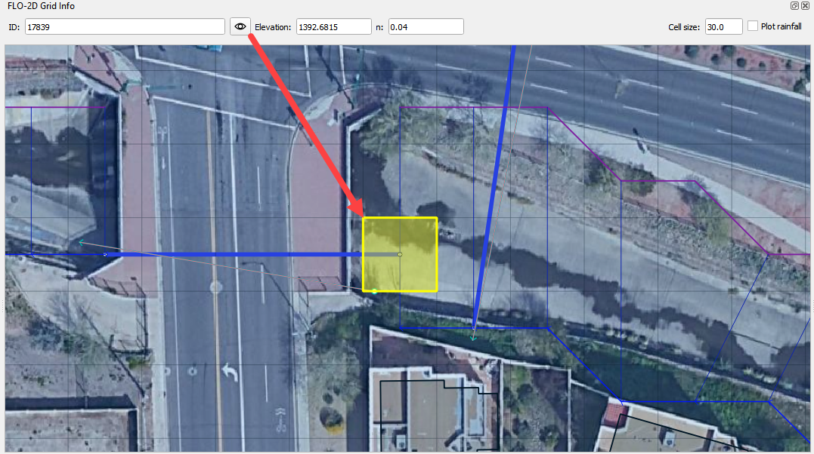

Grid Info Tool
==============

This tool loads the FLO-2D Grid Info panel.

Grid Info Tool
---------------

1. Click the Grid Info Tool button.

.. image:: ../../img/Buttons/gridinfo.png

.. note:: The Grid Info Tool will stay selected throughout its use. Ensure the tool is deactivated after use.

    .. image:: ../../img/Grid-Info-Tool/gridinfotool3.png

2. Click any grid element or enter a grid
   element number into the ID: field and click the Eye.

3. Ensure the tool is deactivated after use.