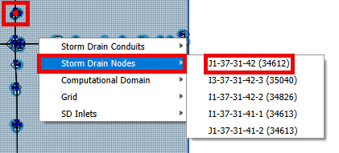
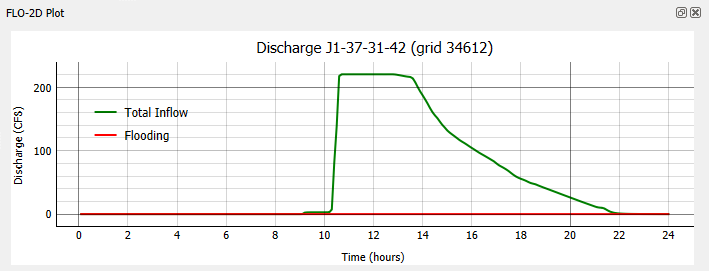

Select .RPT File
=================

This tool loads the SWMM5 report file (\*.RPT) for reading with the Info Tool.

.. note:: Currently,  the Info Tool is limited to reading Storm Drain nodes information.

Select .RPT File
----------------

1. Click on Select .RPT File.

.. image:: ../../img/Select-Rpt-File/selectrptfile001.png

2. Select the swmm.RPT file.

.. image:: ../../img/Select-Rpt-File/selectrptfile002.png

3. Click on the Storm Drain node and select it.

4. The details associated with this node will be displayed on the FLO-2D Plot.

