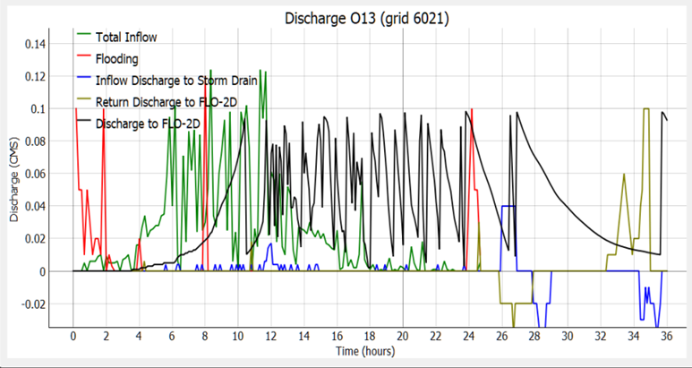

Select .RPT File
=================

This tool loads the SWMM5 report file (\*.RPT) for reading with the Info Tool.

.. note:: Currently,  the Info Tool is limited to reading Storm Drain nodes information.

Select .RPT File
----------------

1. Click on Select .RPT File.

.. image:: ../../img/Select-Rpt-File/selectrptfile001.png

2. Select the swmm.RPT file.

3. Select the ‘Info Tool’ command.

.. image:: ../../img/Buttons/floinfo.png

4. Click on a desired Storm Drain node to select it.

5. The details associated with this node will be displayed in a FLO-2D plot.

.. note:: In the above example 5 plots are displayed:

          - Total Inflow
          - Flooding
          - Inflow Discharge to Storm Drain
          - Return Discharge to FLO-2D
          - Discharge to FLO-2D

          The ‘Total Inflow’ and ‘Flooding’ plots are constructed from data in the .RPT file.
          The ‘Inflow Discharge to Storm Drain’ and ‘Return Discharge to FLO-2D’ plots are built from
          time series data in the SWMMQIN.OUT file (if it exists).
          The ‘Discharge to FLO-2D’ plot is created from time series data in the SWMMOUTFIN.OUT file (if it exists).

6. Turn plots on and off by left clicking anywhere on the FLO-2D plot.
   It is possible to turn on/off each individual plot and legend.

