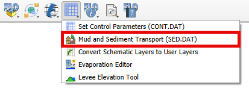
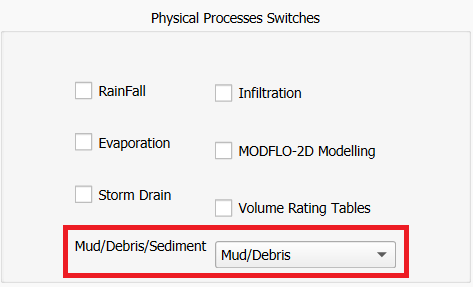
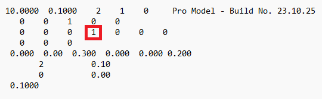
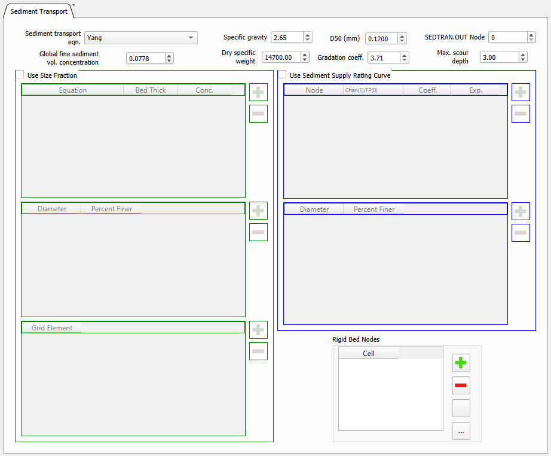
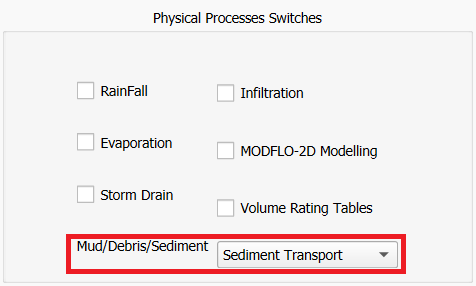
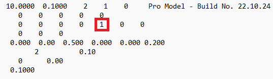
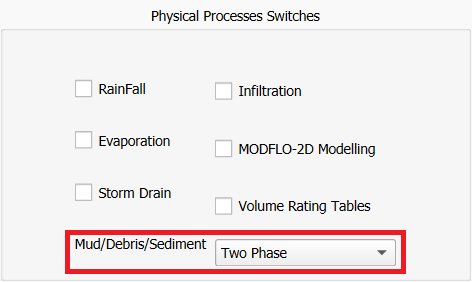
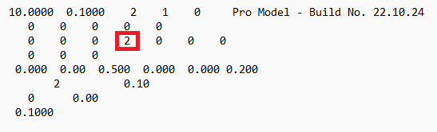

Mud and Sediment Transport (SED.DAT)
=====================================

1. Click on the Mud and Sediment Transport (SED.DAT).

Mud / Debris Transport
----------------------

Very viscous, hyperconcentrated sediment flows are generally referred to as either mud or debris flows.
Mudflows are non-homogeneous, nonNewtonian, transient flood events whose fluid properties change significantly
as they flow down steep watershed channels or across alluvial fans.
Mudflow behavior is a function of the fluid matrix properties, channel geometry, slope, and roughness.
The fluid matrix consists of water and fine sediments.
At sufficiently high concentrations, the fine sediments alter the properties of the fluid including density,
viscosity, and yield stress.

2. Select the Mud / Debris Transport.

.. image:: ../../img/Mud/mud002.png

Hyperconcentrated Sediment Flow Parameters

- Mudflow specific gravity is the density of mudflow divided by the density of water.
- Laminar flow resistance is used for laminar and transitional flows when turbulence is suppressed and the laminar flow resistance parameter K becomes important. In the FLO-2D model if K = 0 in the SED.DAT file, the value of K is automatically computed from the Manning’s n-value.
- Viscosity and Yield Stress as function of Sediment Concentration. Existing relationships can be found in the FLO-2D white paper: "Simulating Mudflow Guidelines".

Debris Basin Parameters

- Debris basin cell is the grid element with the debris basin.
- Debris basin volume in ft3 or m3.

In the Control Variables, the Mud/Debris/Sediment switch under Physical Processes must be set to Mud/Debris for a Mudflow simulation.

When exported, the CONT.DAT file must have the MUD switch set to 1 for a Mudflow simulation.

Sediment Transport
------------------

FLO-2D has a sediment transport component that can compute sediment scour or deposition.
Within a grid element, sediment transport capacity is computed for either channel, street or overland flow based on the flow hydraulics.
The sediment transport capacity is then compared with the sediment supply and the resulting sediment excess or deficit is uniformly distributed over the grid element potential flow surface using the bed porosity based on the dry weight of sediment.

2. Select the Sediment Transport.

- Sediment transport equations. FLO-2D has eleven sediment transport capacity equations. Each sediment transport formula was derived from unique river or flume conditions and the user is encouraged to research the applicability of a selected equation for a particular project.
- Specific gravity is the density of sediment divided by the density of water.
- D50 (mm) is the sediment size in millimeters for sediment routing.
- SEDTRAN.OUT Node is the grid element (channel or floodplain) for which the sediment transport capacity for all the sediment transport equations will be listed by output interval TOUT in the SEDTRAN.OUT file. Note that only one equation is used in the actual sediment routing calculations, but the results of all equations are presented in SEDTRAN.OUT.
- Global fine sediment volume concentration for overland, channel and streets. It is used only in Woo-MPM sediment transport equation.
- Dry specific weight of the sediment in lb/ft3 or N/m3
- Gradation coeff. is a non-dimensional sediment gradation coefficient for the sediment transport routine.
- Max. scour depth is the maximum allowable scour depth (ft or m) for all floodplain elements.

- Use Size Fraction. If checked, the sediment routing will be performed by size fraction.
- Use Sediment Supply Ration Curve. If checked, a sediment rating curve will be used to define the sediment supply to a channel reach or floodplain area.
- Rigid Bed Nodes. If added, the floodplain or channel grid elements will have a rigid bed.

In the Control Variables, the Mud/Debris/Sediment switch under Physical Processes must be set to Sediment Transport for a Sediment Transport simulation.

When exported, the CONT.DAT file must have the ISED switch set to 1 for a Sediment Transport simulation.

Two Phase
---------

To apply the FLO-2D two-phase flow component, the sediment transport and mudflow model components must run concurrently, exchanging sediment between them.
The flood hydraulics for conventional sediment transport is first computed and then the mudflow hydraulics are computed in a second loop.
Water and sediment volume conservation is tracked in both components separately on a grid element basis.

2. Select the Two-phase.

In the Control Variables, the Mud/Debris/Sediment switch under Physical Processes must be set to Two Phase for a Two Phase simulation.

When exported, the CONT.DAT file must have the MUD switch set to 2 for a Two Phase simulation.

