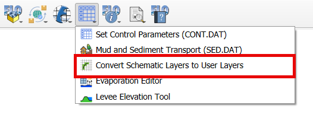
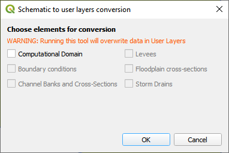

Convert Schematic Layers to User Layers
========================================

This tool will convert imported \*.dat files to editable user layers.
Use it after performing an Import FLO-2D \*.DAT files.

Convert Schematic Layers to User Layers
----------------------------------------

1. Click the
   Convert Schematic Layers to User Layers button.

2. Select the
   layers that need to be edited.

.. note:: Always select
          Computational Domain.

3. The most helpful
   layers to convert are:

   - Computational Domain

   - Floodplain Cross-Sections

   - Boundary Conditions

