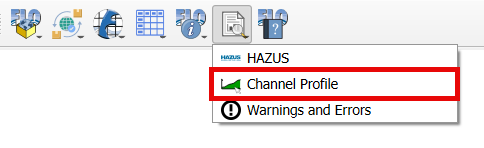
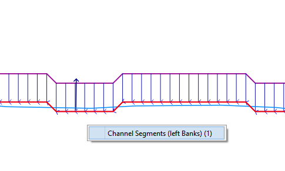
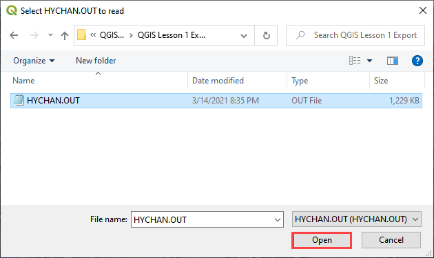
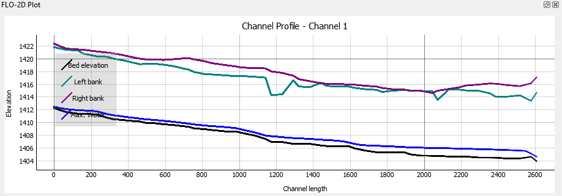

Channel Profile
====================

This tool can be used to plot profiles of various layers but is most used to plot the channel profile.

Channel Profile
----------------

1. Click the Channel Profile and click any
   left bank line.

.. note:: The Channel Profile will stay selected throughout its use. Ensure the tool is deactivated after use.

    .. image:: ../../img/Channel-Profile/channelprofile7.png

2. Select the left bank
   from the menu.

3. The profile plot is loaded into the Plot area and the data is loaded
   into the Table area.

.. image:: ../../img/Channel-Profile/channelprofile3.png

4. GoTo the Cross Section Editor widget and click the Import Channel Peaks (HYCHAN.OUT) tool.

.. image:: ../../img/Channel-Profile/channelprofile4.png
   

5. To add water surface elevation to the plot, load the data first from
   the HYCHAN.OUT file. Navigate to the file HYCHAN.OUT and click Open
   to load it into the project.

  

6. The channel plot will automatically update.
   automatically update.

7. Ensure the tool is deactivated after use.
  