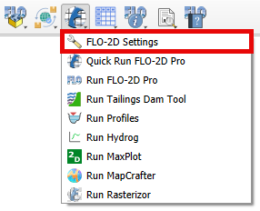

Debug Tool
===========

.. image:: ../../img/Buttons/debug.png

Warnings and Errors
-------------------

The Warnings and Errors feature provides a system to assist users in debugging data files
and identifying data conflicts. To utilize this tool effectively, follow the steps outlined below.

1. Open the FLO-2D Settings

2. Perform a debug run

.. image:: ../../img/Debug/debug2.png

.. image:: ../../img/Debug/debug4.png

.. image:: ../../img/Debug/debug3.png

3. This will automatically trigger the FLO-2D check system performed by
   the engine FLOPRO.EXE.

.. note:: The DEBUG.OUT file is created when the user runs the model in Debug mode.
          This file helps to identify data errors and data conflicts. These error
          checks do not include any simulation results.

4. The model will execute, perform the data checks and then
   automatically shut down. Every time the debug is executed, a new
   debug file with a timestamp is saved to the project folder.

.. image:: ../../img/Debug/debug5.png

5. Click the Error and
   Warning button to open the import dialog box.

.. image:: ../../img/Buttons/debug.png

.. image:: ../../img/Debug/debug6.png

.. note:: The Errors and Warnings shows all Errors, Conflicts, and
          Warnings created by the file checking program. All of these boxes can be
          used to sort and view and pan to cells with potential issues.

DEBUG File
----------

1. To import the Debug files, click the Import DEBUG File button. The
   DEBUG file will have a date and timestamp to track progress.

.. image:: ../../img/Debug/debug7.png

2. The import process will include several files that can be used to
   help users review surface features such as rim elevations, depressed
   elements and channel – floodplain interface. Click Yes to load the
   Errors and Warning Dialog box and import the review files.

.. image:: ../../img/Debug/debug8.png

3. The FLO-2D Warnings and Errors: DEBUG File will initially appear docked at the
   bottom but can be freely repositioned. The Errors/Warnings can be filtered
   by code and grid element using the comboboxes on the top. It is possible
   to zoom in or out to locate the grid element that contains the Error/Warning.

.. image:: ../../img/Debug/debug9.png

Current Project
---------------

1. The Current Project option will create a list of data conflicts. These
   conflicts are not necessarily errors, they are generated based on the
   conflict matrix. The conflict matrix is located at:
   :file:`C:\\Users\\Public\\Documents\\FLO-2D Pro Documentation\\Handouts\\Conflict Matrix.pdf`

2. The FLO-2D Warnings and Errors: Current Project will initially appear docked at the
   bottom but can be freely repositioned. The Errors/Warnings can be filtered
   by component type and grid element using the comboboxes on the top. It is possible
   to zoom in or out to locate the grid element that contains the Error/Warning and
   copy the cell contents.

.. image:: ../../img/Debug/debug10.png

Levee Crests
------------

1. The final option is Levee Crests validation tool. It is used to review
   the levees and grid element elevations.

2. The FLO-2D Warnings and Errors: Levee Crests will initially appear docked at the
   bottom but can be freely repositioned. The Errors/Warnings can be filtered
   by grid element using the comboboxes on the top. It is possible
   to zoom in or out to locate the grid element that contains the Error/Warning and
   copy the cell contents.

.. image:: ../../img/Debug/debug11.png

Debug Layers
------------

1. The layers show points where there are differences between channel bank
   and floodplain bank elevations, rim and floodplain inlet elevations, and
   depressed elements and levee crest elevations. In this example, the
   layers are grouped using a QGIS standard layer grouping procedure.

.. image:: ../../img/Debug/debug12.png

2. Each layer has an attribute table that can be sorted and used to find
   grid elements that may need elevation edits.

.. image:: ../../img/Debug/debug13.png
