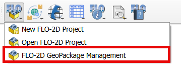
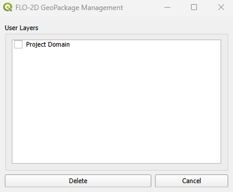
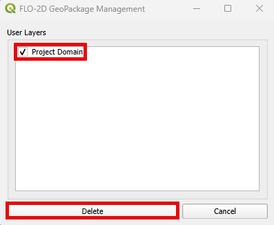
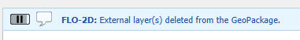

FLO-2D GeoPackage Management
=============================

The FLO-2D GeoPackage Management tool allows users to delete layers added to the GeoPackage.
Whether a layer is too heavy or was added mistakenly, this tool facilitates efficient maintenance of a
well-structured GeoPackage.

FLO-2D GeoPackage Management
-----------------------------

1. Click on the FLO-2D GeoPackage Management button.

2.The FLO-2D GeoPackage Management dialog will appear.

3. Select the layers that will be deleted by checking them on the FLO-2D GeoPackage Management.

3. If the layer was correclty deleted, the following message will appear on the QGIS message toolbar.

.. note::  The layers that can be deleted are layers present on the GeoPackage that were previously added
           by the user. The local layer (shapefile or raster) is maintained. Furthermore, the layers required by
           FLO-2D are not allowed to be deleted and, therefore, are not shown on the FLO-2D GeoPackage Management.