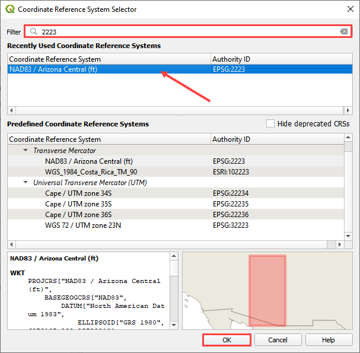

New FLO-2D Project
===================

This button sets up a new FLO-2D Project, defining its coordinate system, GeoPackage file, project information,
and the default values for grid cell size and Manning's. Furthermore, the dialog shows the version details for
the FLO-2D Plugin, FLO-2D Build, and QGIS.

Create a new FLO-2D Project
-----------------------------

1. Click on the
   New FLO-2D Project button.

2. Click the
   Create button to set up the GeoPackage location.

3. Navigate to the project location:
   Project name is the user’s choice.
   Name the file \*.gpkg and click Save.

4. Set the coordinate reference system (CRS) for the project and click
   OK.

5. Assign the Project Information,
   desired grid element size, and baseline n-value.

6. Click OK and the FLO-2D Project is created.

.. image:: ../../img/New-Flo-2D-Project/newflo2dproject005.png

.. note::  The Project Information data is not required but recommended.
           All other input data are required for setting up the FLO-2D Project.
           Check the FLO-2D Plugin, FLO-2D Build, and QGIS versions before creating a new FLO-2D Project.