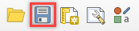
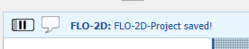
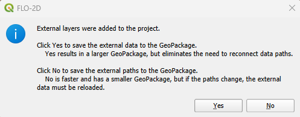

Save FLO-2D Project
===================

In the current FLO-2D Plugin version, the QGIS Project file (\*.qgz) is saved inside the GeoPackage.
This new method has many advantages in terms of portability, styling the symbology, and reducing
potential path errors. It is also allowed to save external user layers to the GeoPackage.

Save a new FLO-2D Project
-----------------------------

1. Click this button to save the FLO-2D Project.

.. note:: Differently from the New and Open FLO-2D Project buttons, this one is the native QGIS save button, located
          at the top left of QGIS.

2. If no error was found and no external layers were added to the project, the following message will appear on QGIS
   toolbar showing that the project was correctly saved.

Saving external layers into the geopackage
-------------------------------------------

3. If external layers are present in the project, the following message will appear.

4. This message shows the user two options: Yes to save the external data to the GeoPackage, resulting in a larger
GeoPackage but eliminating the need to reconnect data paths; No to save the external paths to the GeoPackage, resulting
in a faster and smaller GeoPackage but if the paths change the external data must be reloaded.

.. note:: The current version only supports vectors and rasters to be saved to the geopackage. CSV files and basemaps
          are not allowed.