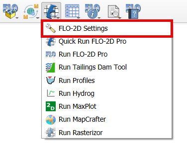
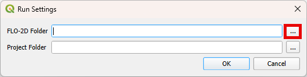
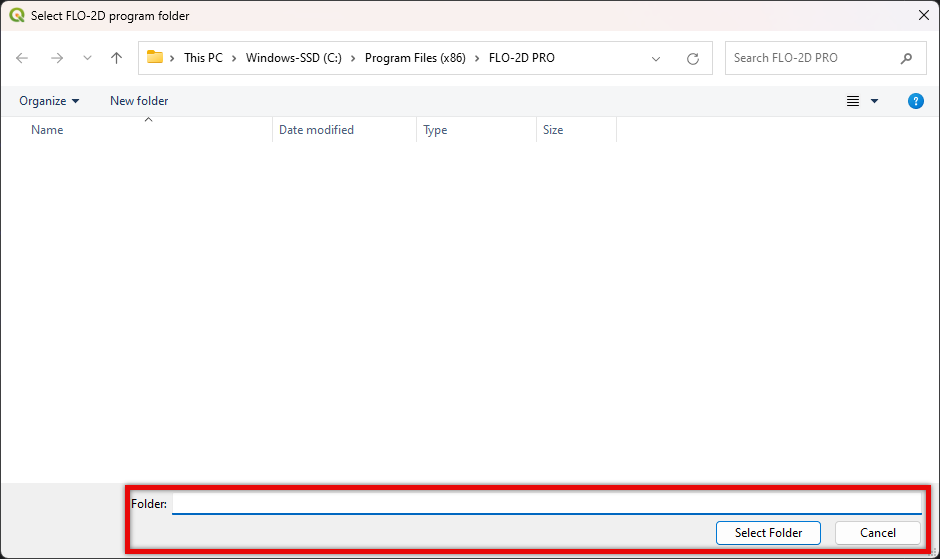
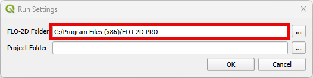
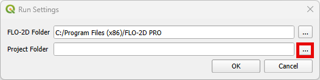
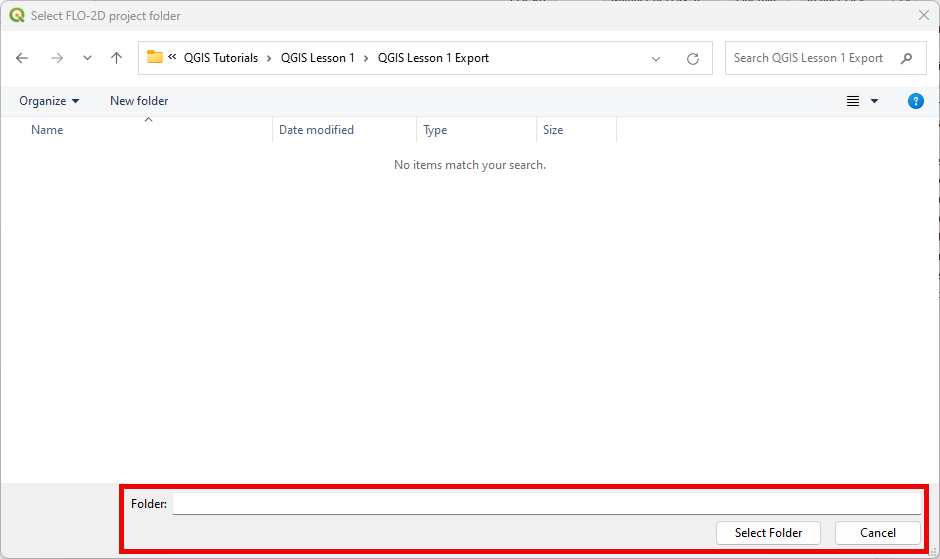
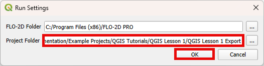

FLO-2D Plugin Settings
======================

The FLO-2D Plugin Settings tool is used to set up the FLO-2D executable folder and the FLO-2D Project folder.

FLO-2D Plugin Settings
------------------------

1. Click on the
   FLO-2D Plugin Settings tool button.

2. Click on the button to select the FLO-2D PRO folder.

3. Navigate to the FLO-2D PRO folder.

.. note:: The default path is: "C:\\Program Files (x86)\\FLO-2D PRO"

4. Click OK to select the FLO-2D PRO folder.

5. Click on the button to select the FLO-2D Project folder.

.. note:: This is the folder where FLO-2D PRO is going to run and generate the \*.OUT files.

6. Click OK select the FLO-2D Project folder.

7. Click OK to save the settings.

.. note:: The FLO-2D Project folder is updated everytime that files are exported. Double check the FLO-2D Project folder
          prior running a simulation.

FLO-2D Plugin Settings
------------------------

See `Debug Tool <../flo-2d-project-review/Debug%20Tool.html>`__ for the Debug Run.