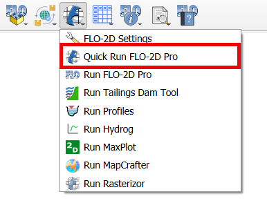
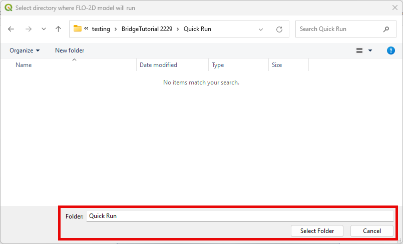
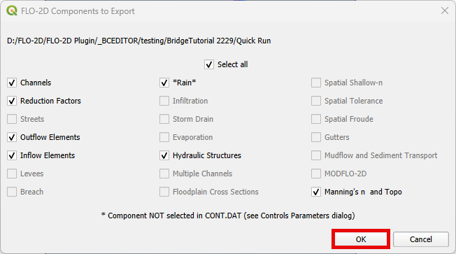
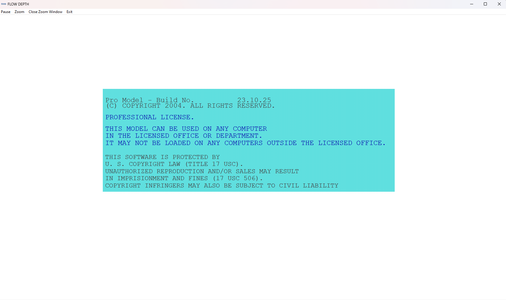

Quick Run FLO-2D Pro
=====================

The Quick Run tool streamlines the export of data and the execution of a FLO-2D run in one go,
eliminating the need for separate export and run steps.

.. note:: The current version does not allow Quick Runs for projects that use the Storm Drain engine.

Quick Run FLO-2D Pro
------------------------

1. Click on the Quick Run FLO-2D Pro button.

2. Select the Export Folder.

3. Select the components and click OK.

4. FLO-2D Pro will initialize.

