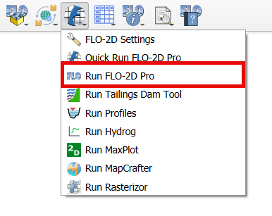

Run FLO-2D
==========

The Run FLO-2D button is used to run FLO-2D.

Run FLO-2D
------------------------

.. note:: It is necessary to configure the correct paths to Run FLO-2D.
          See `FLO-2D Settings <../FLO-2D%20Settings.html>`__

1. Click Run FLO-2D.

2. The FLO-2D Pro will initialize.

.. image:: ../../img/Run-Flo2d/run007.png
