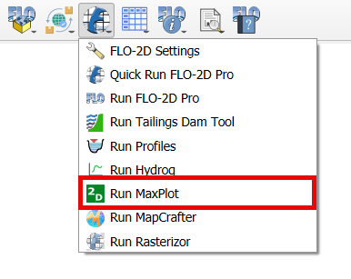
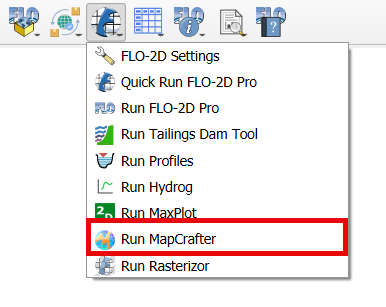
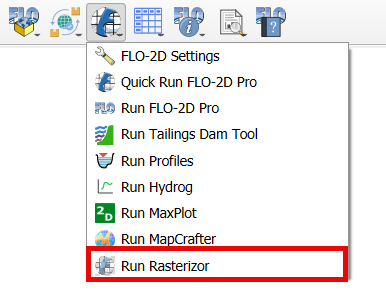

Run FLO-2D
==========

The Run FLO-2D button is used to run FLO-2D and other processing programs.

.. image:: ../../img/Buttons/runflo2d.png
  

1. Run FLO-2D Click
   the Run FLO-2D button on the FLO-2D Plugin toolbar.

2. Set the Project
   Export folder location and the location of the FLOPRO.EXE file.

3. Click OK
   to start a simulation.

4. Or Click
   Debug Run to debug a project.

5. It is necessary to export .DAT files before running FLO-2D.
   See `Export FLO-2D .DAT files <#_Export_FLO-2D_*.DAT>`__ below.

.. image:: ../../img/Run-Flo2d/Run004.png
  

6.  Use the
    alternate options to run these processing programs.

7. Tailings Dam Tool is designed to estimate the potential release volume of tailings dam.

.. image:: ../../img/Buttons/run_tailings_dam.png

8.  Profiles is a channel editing and review tool.
    See Workshop Lesson 5 for instructions.

.. image:: ../../img/Buttons/run_profiles.png

9.  Hydrog
    is a tool to review channel and floodplain cross sections.

.. image:: ../../img/Buttons/run_hydrog.png

10.  MaxPlot
     is a tool to make simple plots of the FLO-2D results such as depth and velocity.

11. MapCrafter is a QGIS plugin designed to transform FLO-2D output files into comprehensive visualizations.

12. Rasterizor is a QGIS plugin used to rasterize FLO-2D output data.

