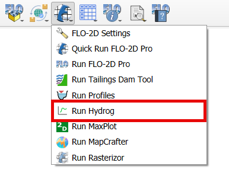
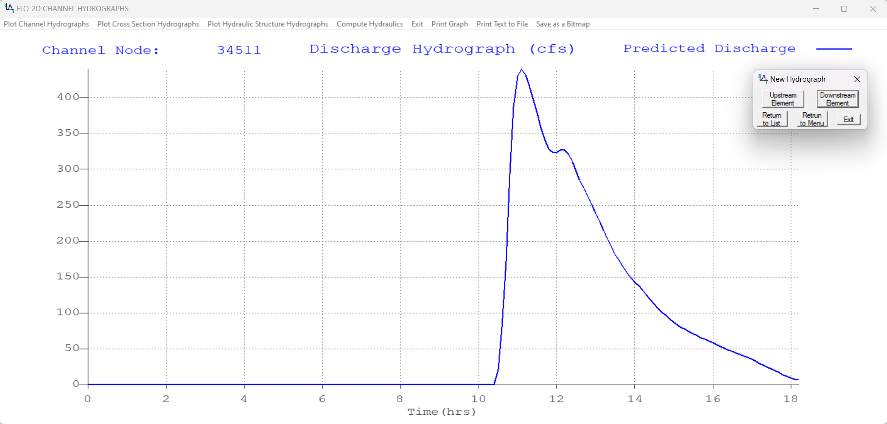

Run Hydrog
===================

Hydrog is a post-processor  program  to  display  channel  and  cross  section
hydrographs.

Run Hydrog
---------------

The Run Hydrog button will load the Hydrog executable in the Project Folder.

1. Click on the Run Hydrog.

2. The Hydrog will show up.

.. note:: The project folder must have a CONT.DAT file and \*.OUT files to run Hydrog.