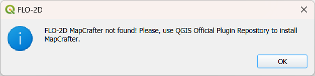

Run MapCrafter
===================

FLO-2D MapCrafter is a QGIS plugin designed to transform FLO-2D output files into comprehensive visualizations.
It generates flood maps for single-phase simulations, sediment maps, mudflow maps, and two-phase simulation flood maps.
Additionally, MapCrafter goes beyond by creating hazard maps, highlighting areas with elevated risks based on FLO-2D
simulations, aiding in risk management. The plugin also streamlines the QGIS layout manager process by automatically
generating templates for easy customization.

Run MapCrafter
----------------

1. Click on Run MapCrafter.

.. image:: ../../img/Buttons/run_mapcrafter.png

2. The MapCrafter will show up.

MapCrafter not installed
-----------------------------

3. If MapCrafter is not installed, the following message will show up.

4. Use the QGIS Plugin Repository to install MapCrafter.

.. image:: ../../img/Run-Mapcrafter/runmapcrafter003.png

5. Look for MapCrafter on All and install MapCrafter.

.. image:: ../../img/Run-Mapcrafter/runmapcrafter004.png

6. Repeat step one to open MapCrafter.

.. note:: For more information on MapCrafter, check the FLO-2D-MapCrafter Wiki_

          .. _Wiki:  https://github.com/FLO-2DSoftware/FLO-2DMapCrafter/wiki