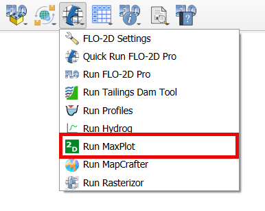
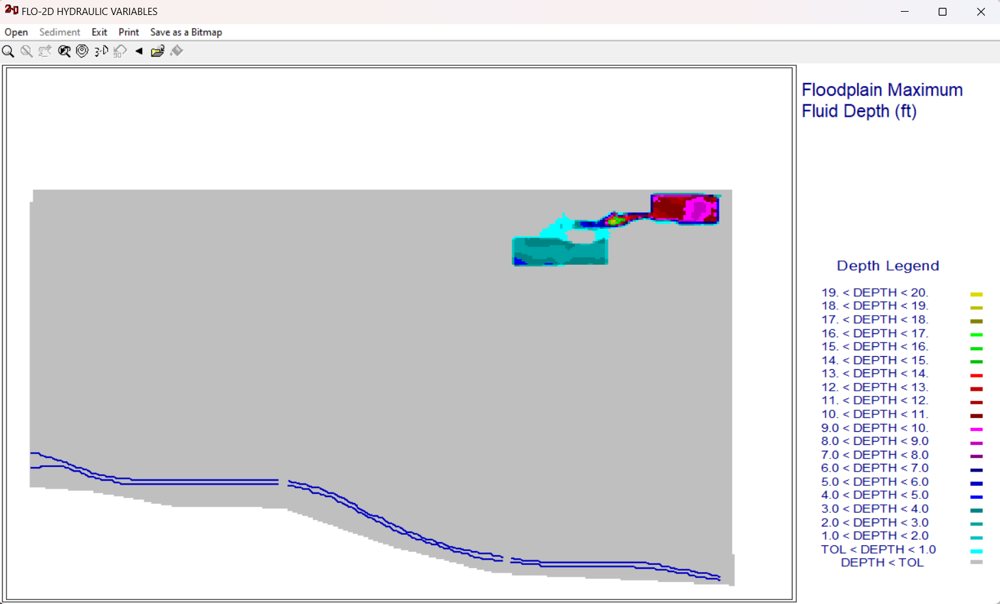

Run MaxPlot
===================

MaxPlot is a post-processor  program  to  display  spatially  variable  results  and
perform difference calculations.

Run MaxPlot
---------------

The Run MaxPlot button will load the MaxPlot executable in the Project Folder.

1. Click on the Run MaxPlot.

2. The MaxPlot will show up.

.. note:: The project folder must have a CONT.DAT and \*.OUT files to run MaxPlot.
