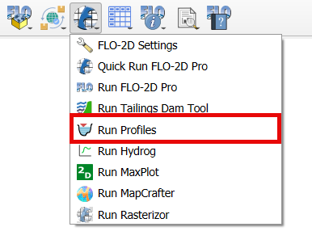
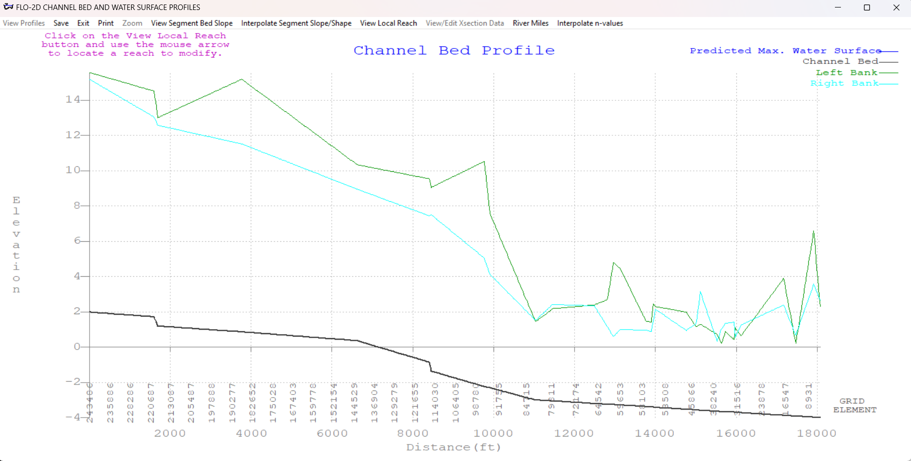

Run Profiles
===================

Profiles is a pre-processor and a post-processor  program  for  graphic  displays
of  the  channel  bed  profile,  cross  sections  and  predicted  water
surface profiles.

Run Profiles
---------------

The Run Profiles button will load the Profiles executable in the Project Folder.

1. Click on the Run Profiles.

2. The Profiles will show up.

.. note:: The project folder must have a CONT.DAT file to run Profiles.
