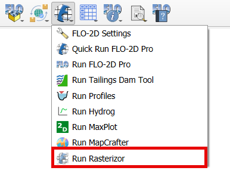
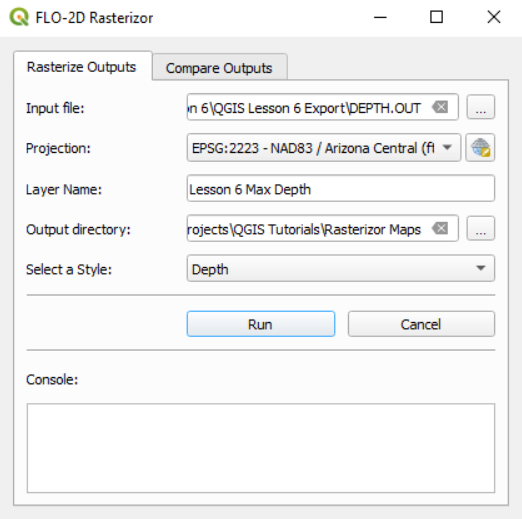
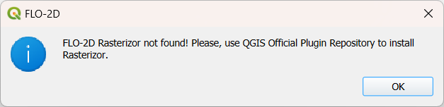
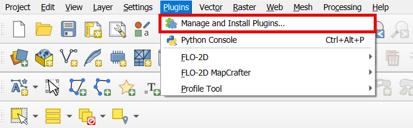
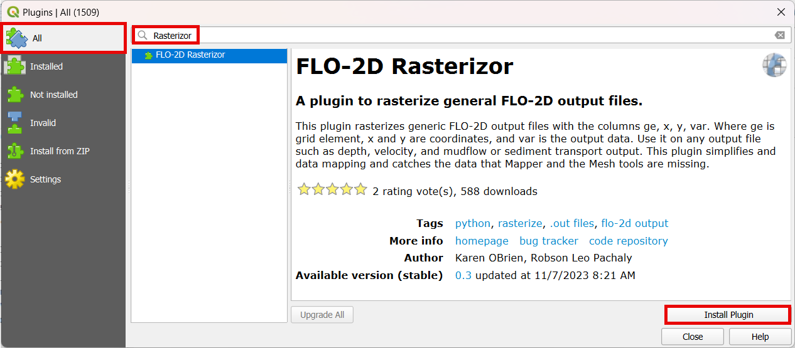

Run Rasterizor
===================

Rasterizor is a QGIS plugin used to rasterize FLO-2D output data. It is a quick mapping tool for FLO-2D output files.
The files should have a standard format with 4 columns ge, x, y, n. These are grid element number, x coordinate,
y coordinate, and n is the mapped value. It could be water surface elevation, depth, velocity or time to depth.
A brief list of files that can be used are:

* DEPFP.OUT
* DEPTH.OUT
* VELFP.OUT
* TIMEONEFT.OUT
* MAXWSELEV.OUT
* Many others

All FLO-2D output files are listed and described in the Chapter 5 of the Data Input Manual.
It is installed on your computer with the software.

Run Rasterizor
-----------------------------

1. Click on Run Rasterizor.

2. The Rasterizor will show up.

Rasterizor not installed
-----------------------------

3. If Rasterizor is not installed, the following message will show up.

4. Use the QGIS Plugin Repository to install Rasterizor.

5. Look for Rasterizor on All and install Rasterizor.

6. Repeat step one to open Rasterizor.

.. note:: For more information on Rasterizor, check the FLO-2D-Rasterizor Wiki_

          .. _Wiki:  https://github.com/FLO-2DKaren/FLO-2D-Rasterizor/wiki